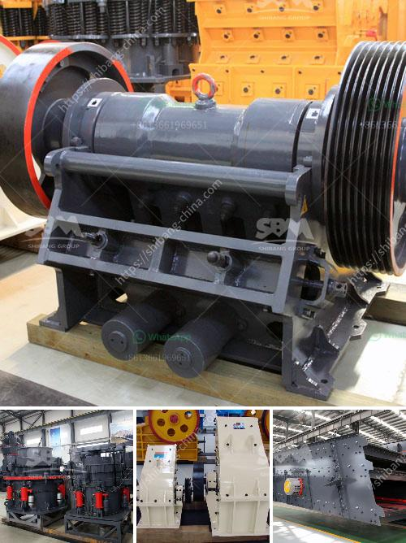

<h3>beneficios de una chancadora conica</h3>
La chancadora cónica, también conocida como trituradora cónica, es una herramienta esencial en la industria minera y de construcción. Esta máquina es utilizada para triturar minerales y rocas grandes en tamaños más pequeños, lo que facilita su procesamiento y transporte. A continuación, analizaremos los beneficios de una chancadora cónica.

En primer lugar, una de las ventajas principales de una chancadora cónica es su capacidad de reducir el tamaño de los materiales de manera eficiente y uniforme. Esta máquina utiliza un mecanismo de aplastamiento en forma de cono, que garantiza una trituración precisa y homogénea de los materiales. Esto es especialmente útil en la industria minera, donde la producción de un tamaño de partícula uniforme es esencial para el procesamiento posterior.

Además, la chancadora cónica es conocida por su alta capacidad de producción. Su diseño robusto y su mecanismo de trituración eficiente permiten procesar grandes volúmenes de material en un corto período de tiempo. Esto significa que la máquina puede manejar con facilidad altos niveles de producción, lo que es beneficioso en los entornos industriales donde se requiere una gran cantidad de material triturado.

Otro beneficio importante de la chancadora cónica es su versatilidad. Esta máquina es capaz de triturar una amplia variedad de materiales, desde piedra caliza hasta minerales duros como el mineral de hierro o el cobre. Esto la convierte en una herramienta valiosa en diversas industrias, como la minería, la construcción y la metalurgia. Además, la chancadora cónica puede ajustarse fácilmente para adaptarse a diferentes tamaños de salida, lo que la hace aún más versátil.

Además de estos beneficios, una chancadora cónica también ofrece un bajo costo de operación y mantenimiento. Muchas de estas máquinas están equipadas con sistemas de automatización avanzados que optimizan el rendimiento y reducen el desgaste de los componentes. Además, su diseño duradero y de alta calidad garantiza una larga vida útil con un mínimo de reparaciones y reemplazos.

Por último, una chancadora cónica también contribuye a la protección del medio ambiente. Al triturar los materiales en tamaños más pequeños, esta máquina facilita su transporte y reduce la necesidad de volúmenes más grandes de material. Esto disminuye la cantidad de energía requerida para el transporte y minimiza las emisiones de gases de efecto invernadero. Además, al procesar los materiales de manera más eficiente, se evita el desperdicio y se utiliza de forma más efectiva.

En resumen, los beneficios de una chancadora cónica son numerosos y significativos. Desde su capacidad para triturar materiales de manera eficiente y uniforme, hasta su versatilidad y bajo costo de operación, esta máquina es una inversión valiosa para cualquier empresa en la industria minera y de construcción. Además, su contribución a la protección del medio ambiente la convierte en una opción aún más atractiva.
<h3>Contact us</h3><ul><li><strong>Whatsapp:&nbsp;<a href="https://wa.me/8613661969651">+8613661969651</a></strong></li><li><a href="https://swt.shibang-china.com/?git&amp;zhl&amp;beneficios de una chancadora conica"><strong>Online Service(chat now)</strong></a></li></ul><h3>Related</h3><ul><li><a href='cost gravel crusher.md'>cost gravel crusher</a></li><li><a href='washing plant setup cost south africa.md'>washing plant setup cost south africa</a></li><li><a href='new technology stone crusher.md'>new technology stone crusher</a></li><li><a href='jual jaw crusher kenya.md'>jual jaw crusher kenya</a></li><li><a href='small scale gold mining equipment in ghana price.md'>small scale gold mining equipment in ghana price</a></li></ul>