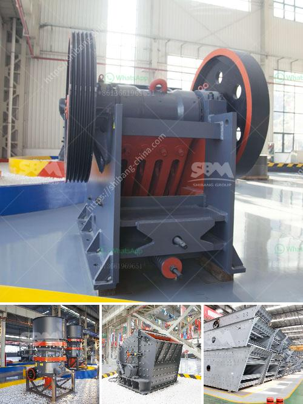

<h3>bentonite clay processing production line supplier</h3>
Bentonite clay is a product formed from volcanic ash. The US, France, and Italy are the main producers of bentonite clay, accounting for 53% of global production. The market for bentonite clay is expected to grow significantly due to its increasing use in various industries such as construction, cosmetics, agriculture, and oil and gas extraction.

Bentonite clay processing production line supplier consists of several stages including mining, drying, crushing, grinding, and packaging. It is crucial to use high quality equipment for each stage in order to ensure efficiency and reliability. Taking bentonite clay as an example, let's look at the processing steps of bentonite clay powder production line:

Mining: Bentonite clay is mined by open-pit method. The overburden is removed to expose the bentonite deposit. The bentonite clay is then carefully extracted using machinery such as draglines, backhoes, and bulldozers.

Drying: The extracted clay is moist and needs to be dried to reduce moisture content. In this stage, the clay is spread out and directly exposed to sunlight or placed in a mechanical dryer. Proper drying is vital to maintain the quality of the clay.

Crushing: The dried clay is then crushed into smaller pieces to facilitate easier handling during the subsequent steps. Depending on the requirements, crushers such as jaw crushers, cone crushers, and impact crushers can be used for primary and secondary crushing.

Grinding: After crushing, the clay is ground into a fine powder using various types of grinding mills. The size of the powder determines its application. Coarse powder is used in agriculture, while finer powder is used in industries such as cosmetics and drilling.

Packaging: Finally, the processed clay powder is packaged into bags or containers for distribution. The packaging should be carefully done to prevent the powder from absorbing moisture or getting contaminated.

Choosing a reliable bentonite clay processing production line supplier is essential to ensure a smooth production process and high-quality end products. The supplier should have experience in the industry and provide efficient equipment that meets safety and quality standards.

It is recommended to choose a supplier that offers a complete solution, including consultation, equipment design and installation, staff training, and after-sales service. A reputable supplier will also provide technical support and troubleshooting in case of any issues during the production process.

In conclusion, bentonite clay processing production line suppliers play a crucial role in ensuring the efficient processing of bentonite clay for various industries. The production line consists of several stages including mining, drying, crushing, grinding, and packaging, requiring high-quality equipment and expertise. Selecting a reliable supplier is essential for achieving optimal production efficiency and high-quality end products.
<h3>Contact us</h3><ul><li><strong>Whatsapp:&nbsp;<a href="https://wa.me/8613661969651">+8613661969651</a></strong></li><li><a href="https://swt.shibang-china.com/?git&amp;zhl&amp;bentonite clay processing production line supplier"><strong>Online Service(chat now)</strong></a></li></ul><h3>Related</h3><ul><li><a href='portable diamond processing plant supplier.md'>portable diamond processing plant supplier</a></li><li><a href='ball mills malaysia.md'>ball mills malaysia</a></li><li><a href='project report on stone crushing unit.md'>project report on stone crushing unit</a></li><li><a href='south africa limestone crushing and blending plant.md'>south africa limestone crushing and blending plant</a></li><li><a href='cement plant equipment from china.md'>cement plant equipment from china</a></li></ul>