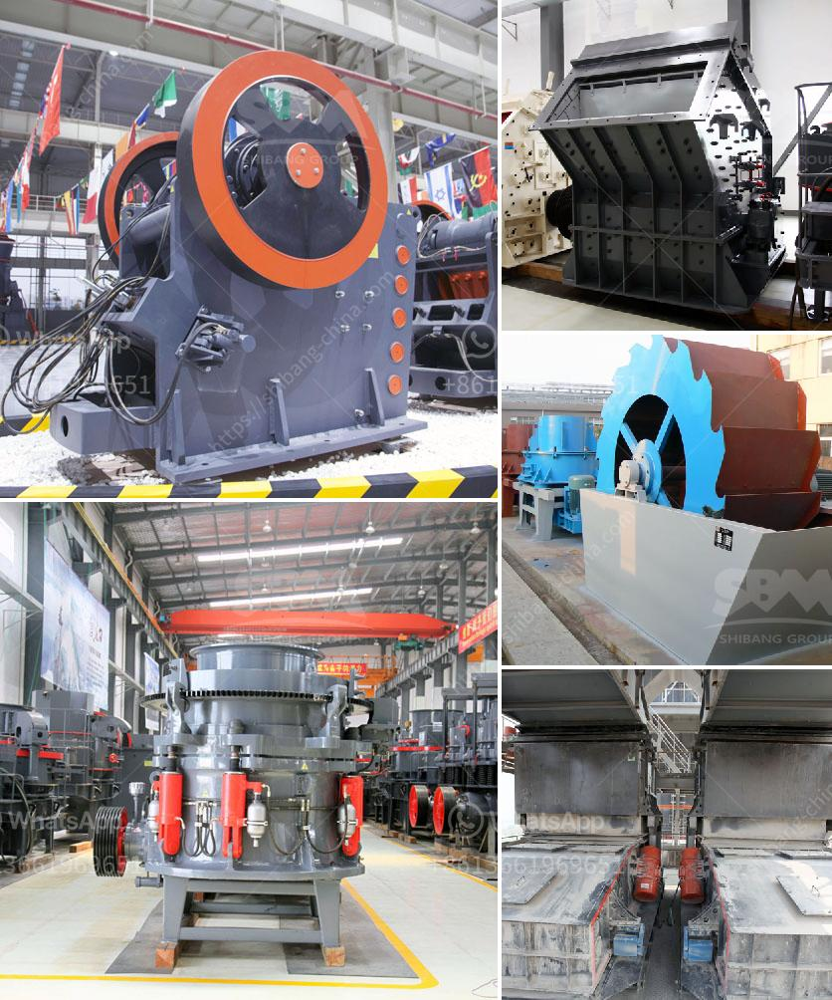

<h3>bentonite crushing machine price list</h3>
Bentonite is a kind of non-metallic ore with good physical and chemical properties. It can be used as a binder, suspending agent, thixotropic agent, stabilizer, purification decolorizer, filling material, feed additive, catalyst, etc. It is widely used in agriculture, chemical industry, petroleum, pharmaceuticals, environmental protection, and other industries. Therefore, the demand for bentonite is increasing, and the market prospect is promising.

To meet the needs of the market, bentonite crushing machine price list is available. Here are some tips about choosing a suitable bentonite crushing machine.

As one of professional manufacturers and suppliers in this field, A&C provides various types of bentonite crushing machines for sale, such as jaw crusher, impact crusher, cone crusher, and mobile crusher with competitive price. All of our crushing equipment is designed in robust and compact structure. It is easy to operate and maintain, and it has excellent crushing performance.

The jaw crusher is usually used as primary crushing equipment, and the impact crusher and cone crusher are often used as secondary crushing equipment. Among them, the impact crusher designed by A&C is widely used in the secondary crushing stage. It can crush materials with compressive strength up to 350MPa. The cone crusher is suitable for crushing hard and medium-hard materials, such as bentonite with Mohs hardness 5-6.

In addition to the above machines, A&C also supplies mobile crushing plant for bentonite quarrying. It is convenient to move and flexible to operate, which saves a large amount of transportation costs. The mobile crushing plant is equipped with vibrating feeder, jaw crusher, vibrating screen, etc. It can complete the crushing operation in a single time, saving time and effort.

Firstly, the performance and working efficiency of the equipment. A good bentonite crushing machine should have stable performance, high production efficiency, and low failure rate.

Secondly, it is necessary to pay attention to the quality of the machine. The materials used in the equipment should be durable and the manufacturing process should be fine. It is better to choose a machine that has passed the international quality certification system.

Thirdly, the price of the machine is an important factor. Different manufacturers offer different prices for the same type of machine. Customers should compare the prices of different manufacturers and choose the one that offers good quality at a reasonable price.

Overall, the demand for bentonite is increasing, and the bentonite crushing machine price list is available to meet the needs of different customers. When choosing a machine, customers should consider the performance, quality, and price of the equipment. With the right machine, customers can efficiently crush bentonite and achieve higher economic benefits.
<h3>Contact us</h3><ul><li><strong>Whatsapp:&nbsp;<a href="https://wa.me/8613661969651">+8613661969651</a></strong></li><li><a href="https://swt.shibang-china.com/?git&amp;zhl&amp;bentonite crushing machine price list"><strong>Online Service(chat now)</strong></a></li></ul><h3>Related</h3><ul><li><a href='gypsum board making machine price in india.md'>gypsum board making machine price in india</a></li><li><a href='project report on stone crushing unit.md'>project report on stone crushing unit</a></li><li><a href='crusher material for stone crusher.md'>crusher material for stone crusher</a></li><li><a href='cost of manganese beneficiation plant.md'>cost of manganese beneficiation plant</a></li><li><a href='limestone crusher rotor mechanical.md'>limestone crusher rotor mechanical</a></li></ul>