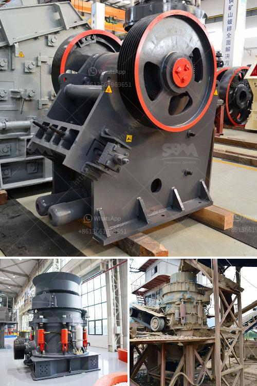

<h3>bentonite granules making machinery india</h3>
Bentonite is a highly versatile and beneficial material used across various industries, such as construction, agriculture, oil and gas, and pharmaceuticals. It is a type of clay that possesses excellent absorbent and swelling properties, making it a popular choice for many applications. In India, the demand for bentonite granules has been steadily increasing, leading to the development of machinery specifically designed to manufacture them efficiently.

The production of bentonite granules involves a multi-step process, including mining, milling, drying, and granulation. To streamline this process and ensure consistent quality, specialized machinery is used. India has seen significant advancements in the development of bentonite granules making machinery, resulting in improved productivity, cost-effectiveness, and overall process efficiency.

One of the key components in the machinery used for bentonite granules production is a high-speed mixer or pug mill. This machine combines the bentonite clay powder with other materials, such as binders or additives, in a homogenous mixture. The pug mill ensures that the powder is thoroughly mixed, eliminating any clumps and ensuring even distribution of the additives. This is crucial in achieving the desired quality and properties of the final granules.

The mixed material from the pug mill is then passed through a granulation machine. This machine is responsible for forming the granules from the mixture. It utilizes a mechanical press or extruder to shape the material into small, spherical pellets. The size and shape of the granules can be adjusted based on the specific requirements of the application. The granulation process also improves the flowability and handling characteristics of the bentonite, making it easier to transport and apply.

In recent years, India has witnessed advancements in granulation machinery, leading to increased automation and efficiency. Modern granulation machines are equipped with advanced control systems, allowing for precise monitoring and adjustment of various parameters, such as screw speed, pressure, and temperature. This ensures consistent and uniform granule size, density, and hardness, further enhancing the quality of the final product.

Another important aspect of bentonite granules making machinery is the drying process. After the granulation, the pellets go through a drying chamber to remove any moisture present. Efficient drying is crucial to prevent clumping or sticking of the granules and to improve their shelf-life. Advanced drying techniques, such as hot air, fluid bed, or rotary dryers, are commonly used in India to achieve rapid and efficient drying of bentonite granules.

The manufacturing of bentonite granules requires specialized machinery to ensure consistent quality and production efficiency. India has been at the forefront of developing such machinery, with advancements in high-speed mixers, granulation machines, and drying systems. These technological advancements have not only improved the productivity and cost-effectiveness of the production process but also enhanced the overall quality and performance of bentonite granules.

With India's growing demand for bentonite granules in various industries, the continuous development and improvement of machinery for their production will play a crucial role in meeting market demands and maintaining the country's position as a leading supplier of high-quality bentonite granules.
<h3>Contact us</h3><ul><li><strong>Whatsapp:&nbsp;<a href="https://wa.me/8613661969651">+8613661969651</a></strong></li><li><a href="https://swt.shibang-china.com/?git&amp;zhl&amp;bentonite granules making machinery india"><strong>Online Service(chat now)</strong></a></li></ul><h3>Related</h3><ul><li><a href='raymond mill price in india.md'>raymond mill price in india</a></li><li><a href='sand manufacturing small scale.md'>sand manufacturing small scale</a></li><li><a href='three roller mill pakistan.md'>three roller mill pakistan</a></li><li><a href='coal crusher 350tph.md'>coal crusher 350tph</a></li><li><a href='roll mills supplier in karachi.md'>roll mills supplier in karachi</a></li></ul>