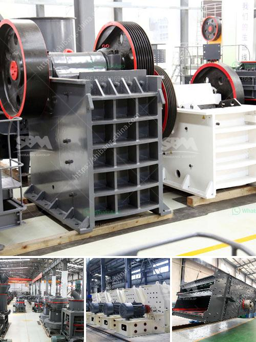

<h3>bentonite powder making</h3>
Bentonite powder is a versatile and cost-effective natural substance that has been used for centuries in various industries around the world. The key to its success lies in its unique properties such as high swelling capacity, water absorption, and thixotropic behavior, which make it an essential ingredient in many products.

Bentonite powder is derived from bentonite clay, a volcanic ash deposit formed millions of years ago. The clay is mined from quarries and then processed into a fine powder. The powdery substance is highly absorbent and has the ability to swell up to 15 times its original size when mixed with water.

One of the main applications of bentonite powder is in the construction industry, particularly in the manufacturing of drilling fluids. These fluids are used during the drilling of oil and gas wells to lubricate the drilling bit and remove the cuttings from the wellbore. Bentonite powder is added to the drilling fluid to increase its density, improve its viscosity, and enhance its ability to suspend and transport the cuttings to the surface.

Another significant use of bentonite powder is in the production of cat litter. The high water-absorption and odor-controlling properties of the powder make it an ideal material for creating clumping cat litter. When exposed to moisture, the bentonite powder forms easy-to-remove clumps, which can be scooped out of the litter box, leaving the remaining litter clean and odor-free.

In the agricultural industry, bentonite powder is used as a soil conditioner and fertilizer. The powder helps to improve the soil's water-holding capacity, increase its cation exchange capacity, and promote root growth. It also helps to prevent soil erosion by binding the soil particles together, making it suitable for areas prone to heavy rainfall or strong winds.

Additionally, bentonite powder is widely utilized in various industries for its ability to thicken, emulsify, and stabilize liquids. It is commonly used in cosmetics, pharmaceuticals, and food processing to enhance the texture and viscosity of products. It can also be found in the manufacturing of paper, paints, adhesives, and sealants.

The process of making bentonite powder involves several steps. First, the raw bentonite clay is mined, dried, and crushed into a fine powder. It is then processed further to remove impurities and achieve the desired particle size distribution. The final powder is carefully packaged to ensure its quality and purity.

In conclusion, bentonite powder is a crucial ingredient in various industries due to its unique properties and versatility. Its high swelling capacity, water absorption, and thixotropic behavior make it indispensable in applications such as drilling fluids, cat litter, agriculture, and many more. The process of making bentonite powder involves careful mining, drying, crushing, and processing to produce a high-quality product.
<h3>Contact us</h3><ul><li><strong>Whatsapp:&nbsp;<a href="https://wa.me/8613661969651">+8613661969651</a></strong></li><li><a href="https://swt.shibang-china.com/?git&amp;zhl&amp;bentonite powder making"><strong>Online Service(chat now)</strong></a></li></ul><h3>Related</h3><ul><li><a href='chrome mining business plan.md'>chrome mining business plan</a></li><li><a href='ball mill plant manufacturers.md'>ball mill plant manufacturers</a></li><li><a href='roll crusher kenya.md'>roll crusher kenya</a></li><li><a href='basic machines used stone crusher.md'>basic machines used stone crusher</a></li><li><a href='cost gravel crusher.md'>cost gravel crusher</a></li></ul>