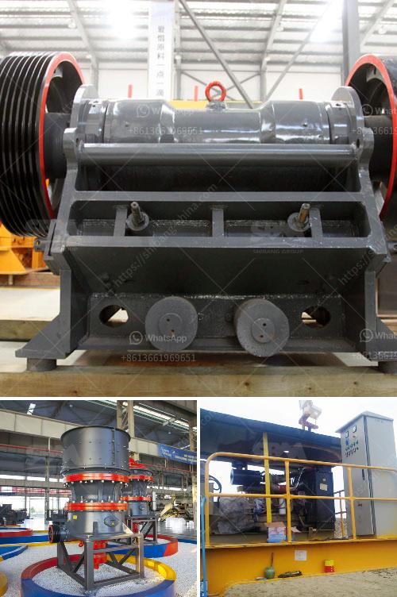

<h3>bentonite powder plant in surat</h3>
Surat, a bustling city in Gujarat, India, has gained fame for its thriving textile industry and diamonds. However, in recent years, another sector has emerged as a major contributor to the city's economic growth - the bentonite powder plant industry. With its myriad applications across various sectors, the bentonite powder plant has become an integral part of Surat's industrial landscape.

Bentonite powder, derived from the natural mineral bentonite, has unique properties that make it indispensable in numerous industries. Known for its high swelling and adsorption capacity, bentonite powder is extensively used as a binding agent, stabilizer, absorber, and additive in many fields, including construction, agriculture, oil and gas, pharmaceuticals, and wastewater treatment, to name a few.

The establishment of bentonite powder plants in Surat has not only boosted industrial growth but has also brought about numerous economic advantages. The influx of new factories and investments has created job opportunities for the local population, improving the standard of living and reducing unemployment rates. The plants also contribute to the overall economic prosperity of the region through increased trade and exports.

The construction industry, in particular, has witnessed a significant transformation due to the use of bentonite powder in Surat. The unique rheological properties of bentonite make it an ideal additive for creating high-quality construction materials. Bentonite powder is commonly used as a binding agent in cement and concrete to enhance their strength, workability, and durability. It also helps prevent cracking and water infiltration, making structures more robust and long-lasting.

Moreover, bentonite powder has revolutionized the field of oil and gas drilling. Its exceptional swelling capacity contributes to the creation of a stable drilling mud that aids in the extraction of oil and natural gas. This application has propelled the expansion of the petroleum industry in Surat and has attracted significant investments from both domestic and international players.

Another significant contribution of bentonite powder plants in Surat is seen in the field of agriculture. Bentonite powder acts as a soil conditioner, improving its fertility and water-holding capacity. It enhances the overall physical and chemical properties of the soil, leading to better crop yields and reduced water consumption. The use of bentonite powder as a natural alternative to synthetic fertilizers and pesticides also promotes sustainable farming practices, minimizing environmental harm.

Furthermore, the presence of bentonite powder plants in Surat has a positive impact on the environment. Bentonite mining and processing are conducted with utmost care to ensure minimal disturbance to the natural surroundings. Strict adherence to environmental regulations and the implementation of sustainable practices, such as land rehabilitation and water conservation, demonstrate the industry's commitment to preserving the local ecosystem.

In conclusion, the bentonite powder plant industry in Surat has emerged as a vital contributor to the city's industrial growth and sustainable development. Through its diverse applications in construction, oil and gas, agriculture, and other sectors, bentonite powder has become an indispensable resource. The establishment of these plants has not only provided employment opportunities and economic prosperity but has also fostered environmentally conscious practices. As Surat's bentonite powder plant industry continues to grow, it further solidifies the city's position as a hub for industrial innovation and sustainable advancement.
<h3>Contact us</h3><ul><li><strong>Whatsapp:&nbsp;<a href="https://wa.me/8613661969651">+8613661969651</a></strong></li><li><a href="https://swt.shibang-china.com/?git&amp;zhl&amp;bentonite powder plant in surat"><strong>Online Service(chat now)</strong></a></li></ul><h3>Related</h3><ul><li><a href='iron ore beneficiation plant.md'>iron ore beneficiation plant</a></li><li><a href='stone crusher for sales in south philippines.md'>stone crusher for sales in south philippines</a></li><li><a href='stone crushers for sale usa.md'>stone crushers for sale usa</a></li><li><a href='limestone handling system scheme with grinding mill.md'>limestone handling system scheme with grinding mill</a></li><li><a href='quartz manufacturing process from mineral.md'>quartz manufacturing process from mineral</a></li></ul>