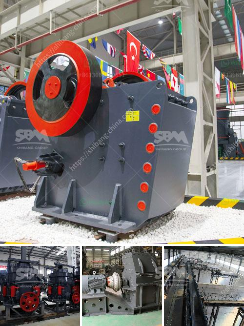

<h3>bentonite powder plant in uae</h3>
The United Arab Emirates (UAE) has always been at the forefront of technological advancements, especially in the construction industry. With its iconic skyscrapers and innovative infrastructure projects, the UAE is known for its progressive thinking and forward-looking approach. One of the key contributors to the success of the construction industry in the UAE is the Bentonite Powder Plant.

Bentonite, a clay mineral known for its versatile properties, has become an indispensable element in various industries, ranging from agriculture to oil and gas. In the construction sector, Bentonite is primarily used as a binding agent, lubricant, and stabilizer in the production of concrete, mortar, and grout. Thanks to its outstanding water absorption capabilities and ability to provide enhanced rheological properties, Bentonite powder has become a game-changer in the construction industry.

The Bentonite Powder Plant in the UAE is a state-of-the-art facility that uses the latest technologies to produce high-quality Bentonite products. With a focus on sustainability and environmental responsibility, the plant utilizes efficient processes to minimize waste generation and reduce carbon emissions. Moreover, the plant ensures a consistent supply of Bentonite powder to meet the ever-growing demands of the construction industry in the UAE and beyond.

One of the significant advantages of using Bentonite powder in construction is its ability to improve the workability and durability of concrete. By incorporating Bentonite powder into the mix, construction professionals can enhance the flow and plasticity of concrete, making it easier to pour and mold. Additionally, Bentonite acts as a natural waterproofing agent, protecting the concrete from moisture penetration, which is especially crucial in regions like the UAE, where the climate is hot and arid.

Furthermore, Bentonite powder is used in the production of mortar and grout, offering significant benefits. Mortar mixed with Bentonite powder exhibits improved adhesion, thus ensuring stronger bonding between bricks or stones. This leads to enhanced structural integrity, making buildings more resistant to seismic activities and other external forces. In the case of grouting applications, Bentonite powder acts as a sealing agent, preventing leakage and improving the efficiency of underground constructions such as tunnels and pipelines.

The UAE's Bentonite Powder Plant plays a crucial role in supporting the thriving construction industry in the region. By providing top-quality Bentonite powder, the plant contributes to the development of iconic landmarks and infrastructure projects, ensuring their longevity and sustainability. Construction professionals can rely on the consistent performance of Bentonite powder, leading to faster and more efficient construction processes, ultimately saving time and costs.

In conclusion, the Bentonite Powder Plant in the UAE is a symbol of progress and innovation in the construction industry. Its exceptional capabilities and sustainable practices make it an essential component of the UAE's infrastructure development. By harnessing the power of the versatile Bentonite mineral, the plant revolutionizes construction methods, ensuring that the UAE remains a global leader in architectural and engineering achievements.
<h3>Contact us</h3><ul><li><strong>Whatsapp:&nbsp;<a href="https://wa.me/8613661969651">+8613661969651</a></strong></li><li><a href="https://swt.shibang-china.com/?git&amp;zhl&amp;bentonite powder plant in uae"><strong>Online Service(chat now)</strong></a></li></ul><h3>Related</h3><ul><li><a href='coal size used for mills.md'>coal size used for mills</a></li><li><a href='selling cone crusher made in china.md'>selling cone crusher made in china</a></li><li><a href='mobile gold processing plant for sale in south africa.md'>mobile gold processing plant for sale in south africa</a></li><li><a href='roller raymond mill.md'>roller raymond mill</a></li><li><a href='rock crusher application.md'>rock crusher application</a></li></ul>