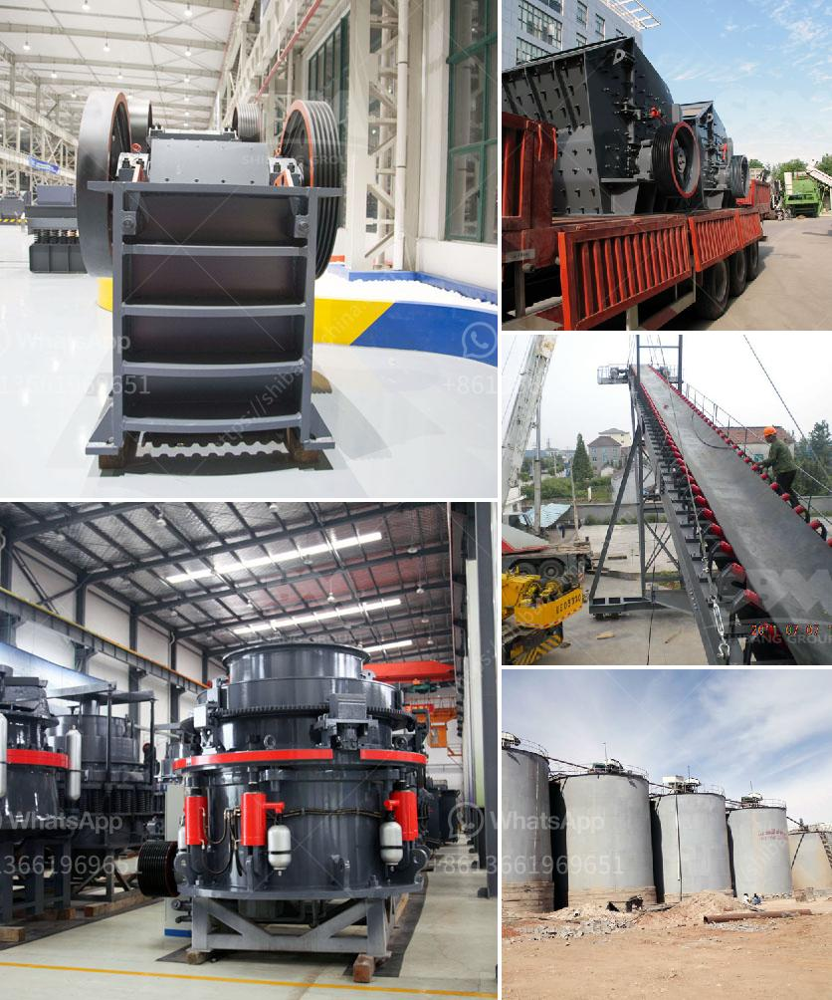

<h3>bentonite processing plant in maharashtra</h3>
Bentonite is a natural clay mineral formed from volcanic ash and water. It has a unique ability to absorb and retain water, making it an excellent choice for various industrial applications. One such application is in the processing of bentonite plants in Maharashtra.

Maharashtra, a state in western India, has a rich reserve of high-quality bentonite. The state accounts for a significant portion of India's bentonite production and is home to several processing plants.

Bentonite processing plants in Maharashtra play a crucial role in the state's economy by generating employment opportunities and promoting industrial growth. These plants extract Bentonite from the quarries and further process it to meet the specific requirements of various industries.

The processing of bentonite involves several steps. First, the raw bentonite is mined from the quarries and then transported to the processing plants. At the plants, it undergoes crushing, drying, and grinding processes to reduce its size and enhance its properties. The crushed and powdered bentonite is then stored in silos for further use.

Bentonite processing plants in Maharashtra cater to various industries such as foundries, oil and gas drilling, construction, and agriculture. In foundries, bentonite is used as a binding agent for molding sand, ensuring the proper shape and structure of castings. In oil and gas drilling, bentonite is used as a drilling fluid to lubricate and cool the drill bit, preventing it from overheating.

The construction industry uses bentonite for waterproofing and as a stabilizing agent for excavations. Agriculture benefits from bentonite's ability to retain water, improving soil moisture content and promoting plant growth.

The bentonite processing plants in Maharashtra adhere to strict quality control measures to ensure that the final product meets the required standards. These plants have state-of-the-art machinery and equipment to handle the processing operations efficiently.

Overall, bentonite processing plants in Maharashtra are vital for the state's economy as they not only provide employment opportunities but also contribute to the growth of various industries. The availability of high-quality bentonite in the region ensures that these plants can continue to meet the demands of domestic and international markets.
<h3>Contact us</h3><ul><li><strong>Whatsapp:&nbsp;<a href="https://wa.me/8613661969651">+8613661969651</a></strong></li><li><a href="https://swt.shibang-china.com/?git&amp;zhl&amp;bentonite processing plant in maharashtra"><strong>Online Service(chat now)</strong></a></li></ul><h3>Related</h3><ul><li><a href='crusher for marble.md'>crusher for marble</a></li><li><a href='cost of ball mill 40tonns capacity.md'>cost of ball mill 40tonns capacity</a></li><li><a href='gypsum production powder manufacturers in europe.md'>gypsum production powder manufacturers in europe</a></li><li><a href='cde sand washing plant price.md'>cde sand washing plant price</a></li><li><a href='coal preparation plant cost.md'>coal preparation plant cost</a></li></ul>