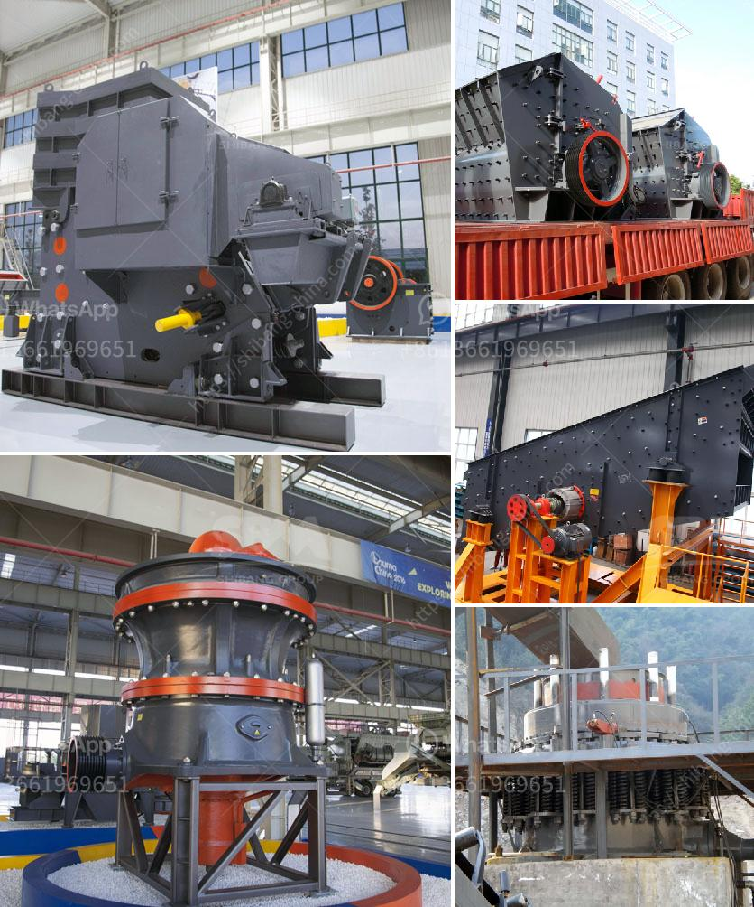

<h3>best machine brands for quarry</h3>
In today's quarrying industry, having reliable and high-quality machinery is essential for the successful operation of any quarry. With numerous brands available on the market, it can be overwhelming to choose the best machine brands for quarrying. However, this article aims to provide you with an overview of some top brands that have proven to be industry leaders.

1. Caterpillar: Caterpillar is a renowned brand that manufactures a wide range of machinery for the quarrying industry. Known for their durability, Caterpillar machines are built to withstand the toughest conditions. With advanced features like GPS technology and telematics systems, Caterpillar equipment offers excellent performance and fuel efficiency. This brand also provides comprehensive after-sales support.

2. Volvo: Volvo is another prominent player in the quarrying sector. Their machinery is known for its reliability, productivity, and fuel efficiency. Volvo offers a range of excavators, wheel loaders, and articulated haulers that perform exceptionally well in quarry environments. Their machines are designed with operator comfort and safety in mind, ensuring maximum productivity and reduced downtime.

3. Komatsu: Komatsu is a globally recognized brand that manufactures heavy machinery for various industries, including quarrying. Their equipment is valued for its exceptional performance, reliability, and advanced technological features. Komatsu's range of excavators and rigid dump trucks is known for their power, fuel efficiency, and operator comfort. Their machines are built to withstand the rigors of quarrying operations, ensuring long-term productivity.

4. Hitachi: Hitachi is a trusted manufacturer of construction and mining equipment, with a strong presence in the quarrying industry. Their machines are known for their advanced technology, durability, and excellent performance. Hitachi offers a range of hydraulic excavators and rigid dump trucks that are highly efficient and reliable, making them suitable for quarry operations of all sizes.

5. Sandvik: Sandvik is a leading brand that specializes in providing cutting-edge solutions for the mining and quarrying sectors. They offer a range of machinery, including crushers, screeners, and drilling equipment, designed to increase productivity and efficiency in quarries. Sandvik's machines are known for their durability, reliability, and innovative features, such as automation and remote control operation.

6. Liebherr: Liebherr is a German manufacturer renowned for producing high-quality machinery for various industries, including quarrying. Their range of excavators, wheel loaders, and dump trucks are known for their exceptional performance, fuel efficiency, and operator comfort. Liebherr's machines are designed to optimize productivity while minimizing operating costs, making them popular among quarry operators.

In conclusion, when it comes to choosing the best machine brands for quarrying, several reputable manufacturers stand out. Caterpillar, Volvo, Komatsu, Hitachi, Sandvik, and Liebherr are renowned for producing reliable, durable, and high-performance equipment. While the choice ultimately depends on specific requirements, these brands offer a diverse range of machines to meet the needs of quarry operators worldwide. Investing in these top-quality brands ensures long-term productivity, reduced downtime, and overall cost-effectiveness for quarrying operations.
<h3>Contact us</h3><ul><li><strong>Whatsapp:&nbsp;<a href="https://wa.me/8613661969651">+8613661969651</a></strong></li><li><a href="https://swt.shibang-china.com/?git&amp;zhl&amp;best machine brands for quarry"><strong>Online Service(chat now)</strong></a></li></ul><h3>Related</h3><ul><li><a href='how much does a stone crusher mill.md'>how much does a stone crusher mill</a></li><li><a href='rent a rock crusher saudi.md'>rent a rock crusher saudi</a></li><li><a href='hammer mill for sale in zimbabwe.md'>hammer mill for sale in zimbabwe</a></li><li><a href='crusher plant cost in pakistan.md'>crusher plant cost in pakistan</a></li><li><a href='portable crushers for rent.md'>portable crushers for rent</a></li></ul>