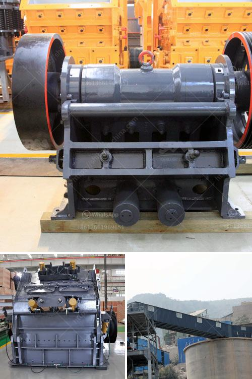

<h3>best stone crusher from south africa</h3>
South Africa is renowned for its solid mineral resources, such as platinum, gold, diamonds, coal, and copper. But, mining is an integral part of South Africa's economy. There are many famous stone crusher manufacturers in South Africa. Stone crushers are widely used in various minerals, such as granite, limestone, copper ore, iron ore, and others. The equipment are popular in South Africa.

Stone crushers are the essential equipment for mining and other industries. Nowadays, the stone crusher has been widely used in houses, roads, bridges, water conservancy, transportation, and other industries. In South Africa, the mining industry is a vital part of the economy due to the abundance of minerals it has. Therefore, stone crushers play an important role in South Africa's mining industry.

Among these types of stone crushers, jaw crusher is the most commonly used primary crusher. It has the traditional advantages of stable operation, simple structure, easy maintenance, and low price. Therefore, jaw crusher is widely used in many different industries, such as mining, metallurgy, building materials, highway, railway, water conservancy, and chemical industries.

Another common type of stone crusher is the cone crusher. It has excellent crushing performance in terms of secondary and tertiary crushing. Cone crushers are usually used in applications where the products are required to be of a particular size or shape.

South Africa has a rich selection of stone crushers. One of the most popular stone crusher manufacturer in South Africa is ZENITH Company. ZENITH has a long history in South Africa and their stone crusher products are popular in the country. In addition to the crushers, ZENITH also produces a series of auxiliary equipment, such as crusher spare parts, vibrating screens, feeders, and conveyors.

ZENITH stone crusher has a great reputation in South Africa. ZENITH products are welcomed by South African customers because of their reliable quality and features. With the development of technology and advanced equipment, ZENITH stone crushers have been greatly improved in terms of structure, performance, and more. Their stone crushers are increasingly popular in South Africa.

The stone crusher from ZENITH Company is in high quality, low cost, and has helped many South African customers start their business in mining and construction industries. ZENITH believes that people who are looking for a stone crusher in South Africa will greatly benefit from their professional and considerate service.

South Africa's mining industry is booming and stone crushers play an important role in it. As the largest producer of minerals in Africa, South Africa is a key mining country. In addition, South Africa's infrastructure construction is also thriving. As a result, stone crushers are in high demand in South Africa.

In conclusion, the stone crusher from ZENITH Company plays an important role in South Africa's mining industry and infrastructure construction industry. It has a great reputation in South Africa and is well received by customers. ZENITH stone crusher provides customers with a reliable choice and helps them succeed in their business.
<h3>Contact us</h3><ul><li><strong>Whatsapp:&nbsp;<a href="https://wa.me/8613661969651">+8613661969651</a></strong></li><li><a href="https://swt.shibang-china.com/?git&amp;zhl&amp;best stone crusher from south africa"><strong>Online Service(chat now)</strong></a></li></ul><h3>Related</h3><ul><li><a href='powder grinfing mill sale.md'>powder grinfing mill sale</a></li><li><a href='buy crusher of jaw.md'>buy crusher of jaw</a></li><li><a href='crusher manufacturers turkey.md'>crusher manufacturers turkey</a></li><li><a href='raymond mill for sale.md'>raymond mill for sale</a></li><li><a href='crushing plants suppliers sales in nigeria.md'>crushing plants suppliers sales in nigeria</a></li></ul>