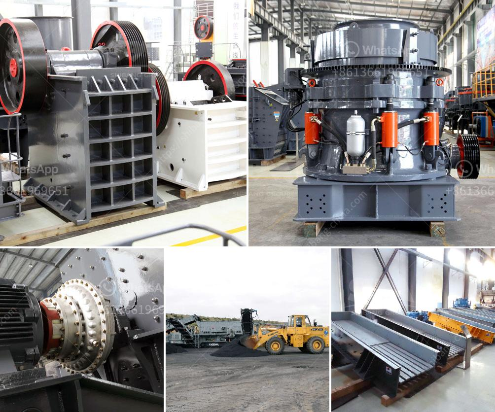

<h3>biaya conveyor belt per meter instalasi</h3>
The cost of installing a conveyor belt per meter is an important consideration for businesses in various industries. Conveyor belts play a crucial role in enhancing productivity and efficiency by transporting goods and materials from one point to another. However, the installation cost can vary depending on several factors.

The first factor that affects the cost of installing a conveyor belt per meter is the type of conveyor system. There are different types of conveyor systems such as roller conveyors, belt conveyors, and chain conveyors. Each type has its own installation requirements and costs associated with it. For instance, belt conveyors may require additional supports and frames, which can increase the installation cost compared to roller conveyors.

The length of the conveyor belt is another factor that influences the installation cost. The longer the conveyor belt, the more material is needed, resulting in higher costs. Additionally, longer conveyor belts might require more supports and accessories to ensure stability and proper functionality.

The complexity of the installation process also impacts the cost. Installing a conveyor belt in a straightforward, open space will be less costly compared to a complex layout that includes multiple turns, inclines, or declines. Complex installations require more technical expertise, time, and potentially additional materials, driving up the overall cost.

Other cost factors include the quality of the conveyor belt, installation labor, and any additional components or accessories needed for the specific application. Higher-quality belts may come at a higher initial cost but can offer better durability and longer service life, reducing maintenance and replacement expenses in the long run.

In conclusion, the cost of installing a conveyor belt per meter can vary depending on factors such as the type of conveyor system, length, complexity of installation, and quality of materials. It is crucial for businesses to carefully consider these factors and consult with experts to obtain an accurate estimate before investing in a conveyor belt system. Investing in a reliable and efficient conveyor belt can ultimately lead to increased productivity and cost savings for businesses in the long term.
<h3>Contact us</h3><ul><li><strong>Whatsapp:&nbsp;<a href="https://wa.me/8613661969651">+8613661969651</a></strong></li><li><a href="https://swt.shibang-china.com/?git&amp;zhl&amp;biaya conveyor belt per meter instalasi"><strong>Online Service(chat now)</strong></a></li></ul><h3>Related</h3><ul><li><a href='stone crushing plant supplier south africa.md'>stone crushing plant supplier south africa</a></li><li><a href='limestone plant machinery manufacturers sale tamilnadu.md'>limestone plant machinery manufacturers sale tamilnadu</a></li><li><a href='screen for iron ore pellets.md'>screen for iron ore pellets</a></li><li><a href='jaw crusher parameters.md'>jaw crusher parameters</a></li><li><a href='new quartz plant cost in india.md'>new quartz plant cost in india</a></li></ul>