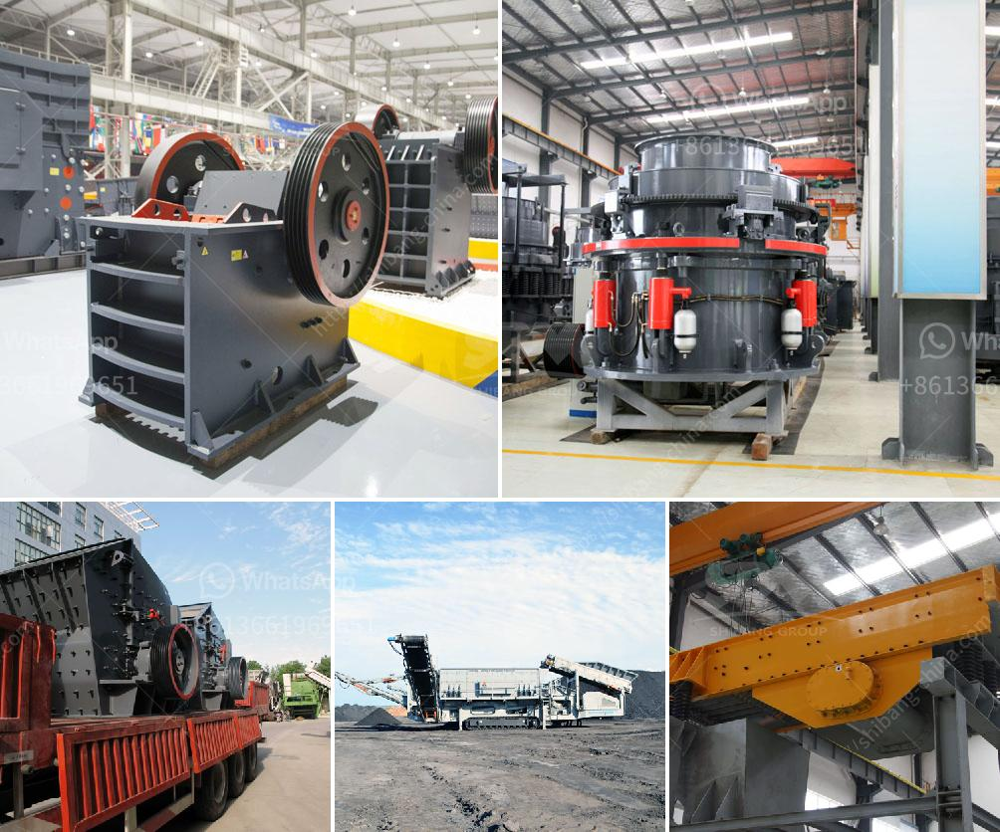

<h3>biggest jaw crusher in the world</h3>
The largest jaw crusher in the world is indeed a sight to behold. The jaw crusher is truly a marvel of engineering and is unparalleled in terms of its crushing capability alone. It boasts a staggering capacity of up to 1,200 tons per hour.

The jaw crusher is widely used in construction, mining, metallurgy and other industries due to its high crushing strength and versatility. It is compact enough to fit into any quarry or mining site, yet potent enough to crush large-sized stones or materials into smaller pieces for further processing.

One of the key features of this jaw crusher is its hydraulic system, which allows for the quick and easy adjustment of the crusher's CSS (closed side setting). This means that operators can easily change the size of the final product by simply adjusting the gap between the jaws. Additionally, the hydraulic system ensures consistent and efficient crushing performance, thus maximizing productivity.

Another impressive aspect of the largest jaw crusher in the world is its sturdy construction. Made from high-quality materials, this machine is built to withstand the toughest conditions and last for years without requiring frequent maintenance. The robust frame and heavy-duty components ensure reliable operation, even when dealing with the hardest rocks or minerals.

Furthermore, the jaw crusher's unique design makes it incredibly efficient in terms of energy consumption. It achieves high reduction ratios with minimal power input, resulting in lower operating costs and improved overall efficiency. This makes it an environmentally friendly choice for crushing operations.

In terms of safety, the jaw crusher is equally impressive. It is equipped with various safety features such as a safety lock system, emergency stop buttons, and a protective enclosure. These components ensure that operators can work safely and minimize the risk of accidents or injuries during operation.

The largest jaw crusher in the world has also revolutionized the way materials are processed. With its high capacity, it can handle large quantities of material, reducing the need for multiple crushers or secondary processing plants. This not only saves time but also lowers costs and makes the entire crushing process more efficient.

Overall, the largest jaw crusher in the world is a remarkable machine that combines exceptional crushing capabilities, safety features, and energy efficiency. It sets a new benchmark for jaw crushers and demonstrates that bigger is indeed better when it comes to crushing equipment. Whether used in mining, construction, or recycling applications, this jaw crusher is a game-changer that transforms the way materials are crushed and processed.
<h3>Contact us</h3><ul><li><strong>Whatsapp:&nbsp;<a href="https://wa.me/8613661969651">+8613661969651</a></strong></li><li><a href="https://swt.shibang-china.com/?git&amp;zhl&amp;biggest jaw crusher in the world"><strong>Online Service(chat now)</strong></a></li></ul><h3>Related</h3><ul><li><a href='stone crusher in mexico.md'>stone crusher in mexico</a></li><li><a href='grinding calcium carbonate equipment.md'>grinding calcium carbonate equipment</a></li><li><a href='stone crushing plant supplier south africa.md'>stone crushing plant supplier south africa</a></li><li><a href='business plan for aggregates production plant pdf.md'>business plan for aggregates production plant pdf</a></li><li><a href='jaw crusher south africa used.md'>jaw crusher south africa used</a></li></ul>