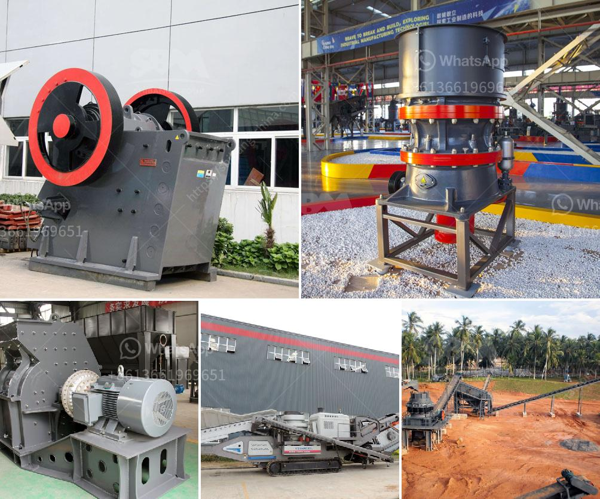

<h3>black powder ball mill grinder</h3>
When it comes to creating explosive concoctions, few materials are as commonly used as black powder. This explosive mixture, also known as gunpowder, has been utilized throughout history for various applications, including firearms, fireworks, and even mining. However, before it can be utilized, black powder must first be manufactured using a mechanical device called a ball mill grinder.

A ball mill grinder, also known as a tumbling mill, consists of a cylindrical container that rotates around its axis. This container is partially filled with various balls, typically made of steel or ceramic materials, which serve as the grinding media. As the container rotates, the balls collide with and crush the substances placed inside, resulting in the creation of finely ground powders.

In the case of black powder production, the process typically involves grinding sulfur, charcoal, and potassium nitrate separately, before combining them to create the explosive mixture. The sulfur and charcoal act as fuel, while the potassium nitrate serves as the oxidizer. It is crucial to achieve the right particle size and homogeneity during the grinding process, ensuring the optimal burning rate and energy release of the black powder.

The ball mill grinder designed for this purpose consists of a rotating chamber with a lid and an inlet and outlet valve. Inside the chamber, there are specially designed plates known as diaphragms that help improve the grinding efficiency and prevent the balls from escaping. The diaphragms are made of a wear-resistant material like rubber or steel to withstand the constant impact and abrasion caused by the grinding media.

To operate the ball mill grinder, the substances to be ground are placed inside the rotating chamber. The chamber is sealed, and the desired grinding duration is set. The rotation speed and the number of balls can also be adjusted to control the grinding process. As the chamber rotates, the materials undergo continuous grinding, reducing their size and turning them into a fine powder.

However, the grinding process must be carefully monitored and controlled to prevent overheating and potential ignition due to friction. Special precautions are taken to minimize the risk of an explosion during black powder production. These include using non-sparking grinding media, ensuring proper ventilation, and maintaining a safe operating temperature.

In conclusion, a black powder ball mill grinder is a mechanical device that produces explosive powders through the process of grinding substances like sulfur, charcoal, and potassium nitrate. The finely ground powders obtained are critical ingredients in numerous applications, including firearms and fireworks. When operating a ball mill grinder for black powder production, rigorous safety measures must be upheld to prevent accidents and ensure the desired performance of the explosive mixture.
<h3>Contact us</h3><ul><li><strong>Whatsapp:&nbsp;<a href="https://wa.me/8613661969651">+8613661969651</a></strong></li><li><a href="https://swt.shibang-china.com/?git&amp;zhl&amp;black powder ball mill grinder"><strong>Online Service(chat now)</strong></a></li></ul><h3>Related</h3><ul><li><a href='limestone impact crusher.md'>limestone impact crusher</a></li><li><a href='gold crushing machine price in usa.md'>gold crushing machine price in usa</a></li><li><a href='nigeria stone crusher.md'>nigeria stone crusher</a></li><li><a href='rock crushing plants.md'>rock crushing plants</a></li><li><a href='ball mill suppliers china.md'>ball mill suppliers china</a></li></ul>