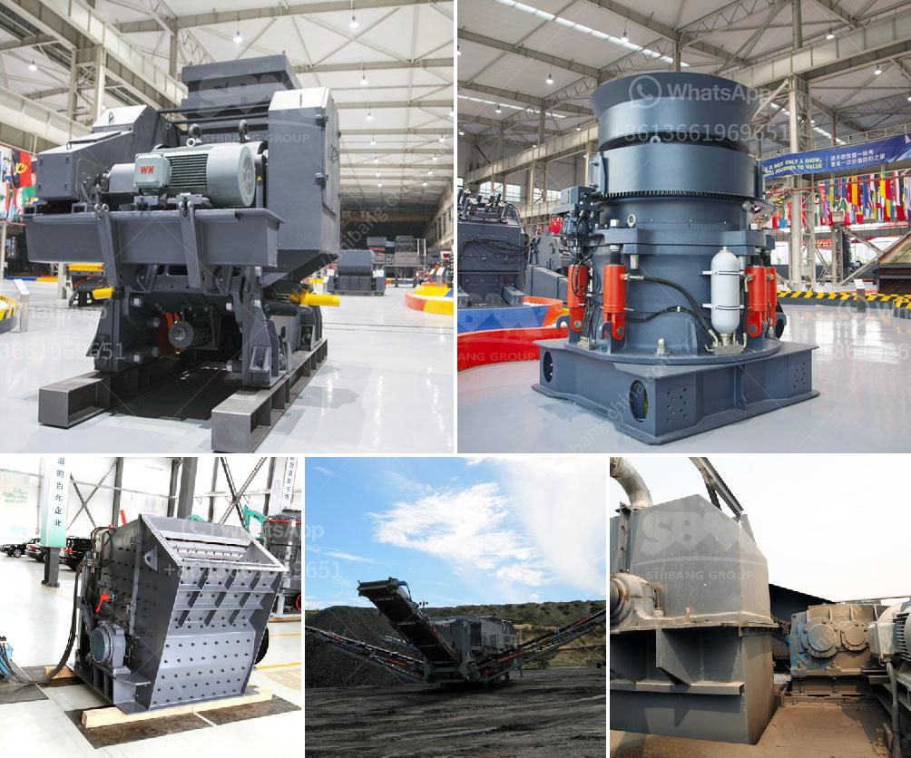

<h3>bradley grinding mill price</h3>
When it comes to grinding mills, efficiency, durability, and cost-effectiveness are key factors to consider. The Bradley grinding mill has been a trusted grinding solution for many industries for over a century. With its robust design and reliable performance, it has become a go-to option for many businesses. However, one question that often arises is the price of a Bradley grinding mill. In this article, we will delve into the factors influencing the price and provide insights on finding the best deal.

First and foremost, it's important to note that the price of a Bradley grinding mill can vary based on several factors. The size and capacity of the mill are primary determinants of the price. Larger mills with higher capacity tend to come with a higher price tag due to the materials and technology required to manufacture them. Additionally, the complexity of the grinding mill's design, the precision of the engineering, and the quality of the materials used also affect the price.

Another crucial factor impacting the price is the optional features and customization. Bradley grinding mills can be equipped with various additional features to enhance their performance and versatility. These may include advanced controls, automated systems, and specific grinding media options. Customization, such as the inclusion of specialized attachments or modifications to suit specific applications, can also influence the price.

It is important to note that while the price may initially seem high, investing in a high-quality grinding mill can prove to be beneficial in the long run. A well-built mill with reliable performance often leads to reduced downtime, lower maintenance costs, and increased productivity. Bradley grinding mills are known for their durability and longevity, making them a cost-effective choice in the long term.

When considering the price of a Bradley grinding mill, it is essential to weigh the different options available in the market. Consulting different suppliers and manufacturers can help you get an idea of the price range. It is also advisable to compare prices from various sources, ensuring that you are getting the best value for your investment.

Furthermore, manufacturers often provide warranties and after-sales support, which can add value to the overall price. An extended warranty and comprehensive customer support can provide peace of mind and protect you against unexpected costs.

In conclusion, the price of a Bradley grinding mill may vary depending on several factors such as size, capacity, optional features, customization, and overall quality. While the initial cost may seem high, investing in a reliable and efficient grinding mill can prove to be a wise decision in the long term. In order to find the best deal, it is important to compare prices from different suppliers and consider the added value of warranties and after-sales support. With careful research and analysis, you can find the ideal Bradley grinding mill at a reasonable price, ensuring your business's grinding needs are met efficiently and cost-effectively.
<h3>Contact us</h3><ul><li><strong>Whatsapp:&nbsp;<a href="https://wa.me/8613661969651">+8613661969651</a></strong></li><li><a href="https://swt.shibang-china.com/?git&amp;zhl&amp;bradley grinding mill price"><strong>Online Service(chat now)</strong></a></li></ul><h3>Related</h3><ul><li><a href='limestone crushing and screening.md'>limestone crushing and screening</a></li><li><a href='marble granding machine.md'>marble granding machine</a></li><li><a href='mobile screen machine.md'>mobile screen machine</a></li><li><a href='machine supplier of stone crusher in philippines.md'>machine supplier of stone crusher in philippines</a></li><li><a href='sand mills for manufacturing.md'>sand mills for manufacturing</a></li></ul>