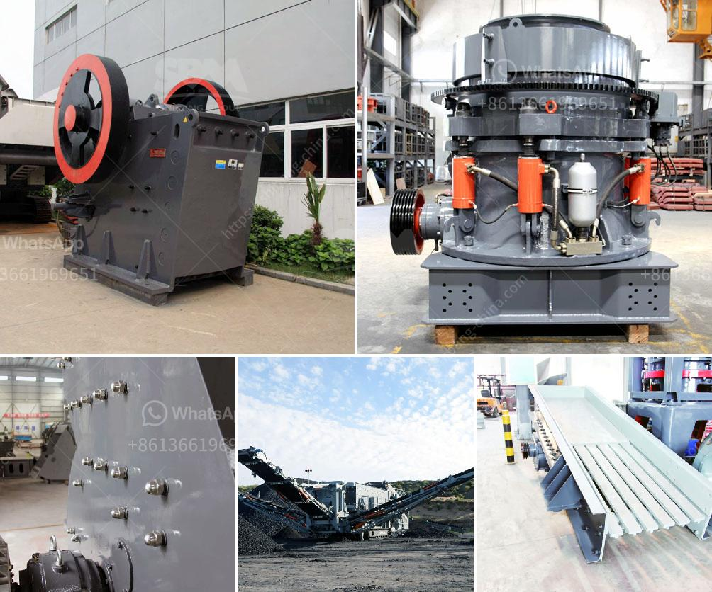

<h3>brand of conveyor belts</h3>
Conveyor belts are an integral part of various industries, enabling the efficient movement of materials and products within manufacturing processes. Choosing the right brand of conveyor belts is crucial to ensure smooth operations, increased productivity, and optimal performance.

One leading brand in the conveyor belt industry is XYZ Belt Company. With years of experience and a solid reputation, XYZ Belt Company offers a wide range of high-quality conveyor belts tailored to meet the diverse needs of different industries. Their commitment to innovation, reliability, and customer satisfaction sets them apart from their competitors.

XYZ Belt Company's conveyor belts are manufactured using premium materials that are durable and resistant to wear and tear, ensuring a longer lifespan and reduced maintenance costs. The belts are designed to handle heavy loads and withstand harsh operating conditions, making them ideal for industries such as mining, construction, and agriculture.

In addition to their exceptional durability, XYZ Belt Company's conveyor belts are engineered to provide optimal performance and energy efficiency. The belts are designed with low friction surfaces that minimize energy consumption, helping companies reduce their carbon footprint and operating costs.

One of the standout features of XYZ Belt Company is their commitment to customization. They understand that every industry has unique requirements, and thus offer tailor-made conveyor belts to suit specific applications. Whether it's a food processing plant, an automotive assembly line, or a bulk material handling facility, XYZ Belt Company delivers customized solutions that ensure seamless operations and maximum productivity.

XYZ Belt Company also stands out in terms of their comprehensive after-sales support and services. Their team of skilled technicians provides prompt assistance, ensuring minimal downtime in case of any issues. Additionally, they offer regular maintenance and inspection services to enhance the longevity and performance of their conveyor belts.

In conclusion, XYZ Belt Company is a reputable brand of conveyor belts that offers high-quality, durable, and customized solutions for various industries. Their commitment to innovation, reliability, and customer satisfaction makes them a preferred choice for those seeking efficient and long-lasting conveyor belt systems. With XYZ Belt Company, businesses can achieve smooth operations, increased productivity, and reduced maintenance costs.
<h3>Contact us</h3><ul><li><strong>Whatsapp:&nbsp;<a href="https://wa.me/8613661969651">+8613661969651</a></strong></li><li><a href="https://swt.shibang-china.com/?git&amp;zhl&amp;brand of conveyor belts"><strong>Online Service(chat now)</strong></a></li></ul><h3>Related</h3><ul><li><a href='25kg h high capacity grinder hammer milling machine.md'>25kg h high capacity grinder hammer milling machine</a></li><li><a href='stone crusher machine price in pakistan.md'>stone crusher machine price in pakistan</a></li><li><a href='activated bentonite production line.md'>activated bentonite production line</a></li><li><a href='crushed stone products mwanza tanzania.md'>crushed stone products mwanza tanzania</a></li><li><a href='cement plant equipment catalogue pdf.md'>cement plant equipment catalogue pdf</a></li></ul>