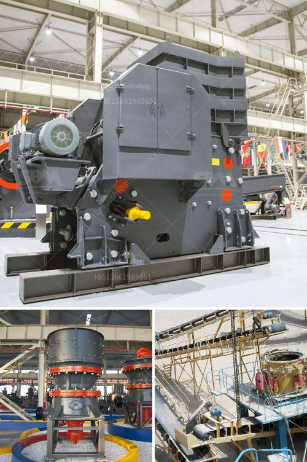

<h3>brick crusher for sale</h3>
Brick crusher for sale, as a leading global manufacturer of crushing and milling equipment, we offer advanced, rational solutions for any size-reduction requirements, including quarry, aggregate, grinding production and complete stone crushing plant. Perhaps you would agree that finding the right brick crusher for sale can be challenging given the wide range of available options. In this article, we will explore the benefits of owning a brick crusher and provide some key tips to consider when purchasing one.

A brick crusher is a machine designed to reduce large rocks into smaller rocks, gravel, or rock dust. Crushers may be used to reduce the size, or change the form, of waste materials so they can be more easily disposed of or recycled, or to reduce the size of a solid mix of raw materials (as in rock ore), so that pieces of different composition can be differentiated. The potential applications for these machines are almost limitless, from brick and concrete waste in construction sites to quarry waste, building rubble, and even glass and other recyclable materials.

One of the primary benefits of owning a brick crusher is its ability to process large amounts of waste materials quickly. This is particularly relevant in the construction industry, where the efficient disposal of waste materials is essential. By crushing the waste materials on-site, contractors can significantly reduce transportation costs, as well as the environmental impact associated with transporting waste to landfills.

Furthermore, brick crushers allow for the recycling of existing brick structures, which can save both money and resources. Instead of producing new bricks, which require the extraction of raw materials and the use of energy-intensive manufacturing processes, recycled bricks can be crushed and reused in new construction projects.

When purchasing a brick crusher, it is important to consider several factors to ensure you make the best choice for your needs. Firstly, you should determine the specific requirements of your project. Consider the type and volume of waste materials you will be processing, as well as the desired output size of the crushed materials. Different models of brick crushers offer varying capacities, power requirements, and size reduction capabilities, so it is essential to match the machine with your specific needs.

Another important factor to consider is the mobility of the brick crusher. Depending on the size of your project and the accessibility of the waste material, you may require a portable or mobile crusher that can be easily transported and set up at various locations. This flexibility can greatly enhance the overall efficiency of your waste management process.

In conclusion, purchasing a brick crusher can be a valuable investment for construction companies and contractors who frequently encounter large amounts of waste materials. The ability to process and recycle these materials on-site can significantly reduce costs, improve efficiency, and promote sustainability in the construction industry. When choosing a brick crusher for sale, consider your specific requirements, such as capacity, output size, and mobility, to ensure you find the most suitable machine for your needs.
<h3>Contact us</h3><ul><li><strong>Whatsapp:&nbsp;<a href="https://wa.me/8613661969651">+8613661969651</a></strong></li><li><a href="https://swt.shibang-china.com/?git&amp;zhl&amp;brick crusher for sale"><strong>Online Service(chat now)</strong></a></li></ul><h3>Related</h3><ul><li><a href='capacity of hammer mills used in kenya.md'>capacity of hammer mills used in kenya</a></li><li><a href='used mining equipment for sale in ghana.md'>used mining equipment for sale in ghana</a></li><li><a href='buy sand washing plant in sri lanka.md'>buy sand washing plant in sri lanka</a></li><li><a href='vertical mill ireland.md'>vertical mill ireland</a></li><li><a href='marble crusher machine in rajasthan.md'>marble crusher machine in rajasthan</a></li></ul>