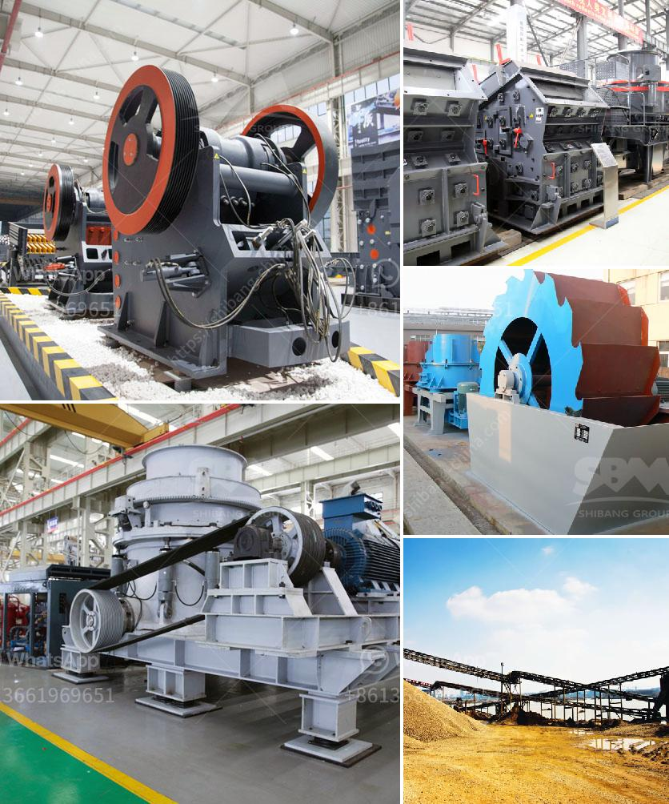

<h3>brick making business plan pdf</h3>
If you're planning to start a brick-making business, one of the first things you need is a comprehensive business plan. Having a well-thought-out plan will not only guide you through the process but also attract potential investors or stakeholders. In this article, we will discuss the key components of a brick making business plan PDF.

1. Executive Summary: This section provides an overview of your business, stating its objectives, mission, and vision. It should also outline your competitive advantage and briefly describe your target market.

2. Company Description: Present a detailed description of your brick-making business, including its legal structure, location, and history. Explain the products or services you'll offer, such as different types of bricks, blocks, or pavers.

3. Market Analysis: Conduct thorough market research to identify your target customers, competitors, and industry trends. Understand the demand for bricks in your local area and determine how you can differentiate yourself from existing players.

4. Marketing and Sales Strategy: Outline your plans to attract and retain customers. Detail your pricing strategy, distribution channels, advertising campaigns, and any partnerships you may have with contractors or suppliers.

5. Organization and Management: Introduce the key personnel involved in your business and highlight their relevant experience. Define their roles and responsibilities to ensure smooth operation.

6. Product Line: Describe the different types of bricks you'll manufacture and their specifications. Include details about the raw materials required, production process, machinery needed, and quality control measures.

7. Financial Projections: Present a comprehensive financial plan, including cash flow statements, profit and loss statements, and balance sheets for the first few years. Include start-up costs, expected revenue, and break-even analysis.

8. Funding Request: If you're seeking external funding, clearly state the amount you require and how it will be utilized. Provide a repayment plan or potential return on investment for investors.

9. Appendix: Include any supporting documents, such as permits, licenses, contracts, or market research data, that strengthen your business plan.

In conclusion, a brick making business plan PDF should cover all aspects of your future venture. It should demonstrate your understanding of the industry, target market, and competition while outlining your financial projections and marketing strategies. A well-crafted business plan will not only serve as a roadmap for your business but also impress potential investors or lenders who can support your growth.
<h3>Contact us</h3><ul><li><strong>Whatsapp:&nbsp;<a href="https://wa.me/8613661969651">+8613661969651</a></strong></li><li><a href="https://swt.shibang-china.com/?git&amp;zhl&amp;brick making business plan pdf"><strong>Online Service(chat now)</strong></a></li></ul><h3>Related</h3><ul><li><a href='bentonite powder plant in uae.md'>bentonite powder plant in uae</a></li><li><a href='limestone plant machinery manufacturers sale tamilnadu.md'>limestone plant machinery manufacturers sale tamilnadu</a></li><li><a href='feldspar grinding machine.md'>feldspar grinding machine</a></li><li><a href='marble crushing line.md'>marble crushing line</a></li><li><a href='iron ore 100 150tph belt conveyor price.md'>iron ore 100 150tph belt conveyor price</a></li></ul>