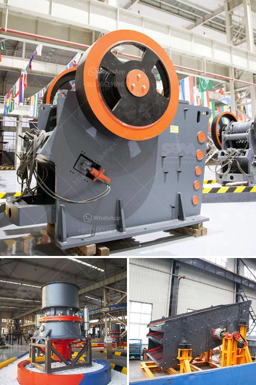

<h3>business plan for a quarry crusher</h3>
A quarry crusher business plan is a lucrative business that needs a lot of strategic planning to start and a business coach like Dayo Adetiloye to help you start the Implementation. Business Description of Quarry Crusher Business Plan in Nigeria

Patilad Quarry produces and sells types and grades of gravel to public and private customers in Abuja and its surrounding State. We are into extraction of primary aggregates like sand and gravel, or crushed rocks. We leverage on our extensive network of buyers and industry suppliers to maximize profit.

Our vision is to establish a standard and world-class – environmental friendly stone quarry company that in our own capacity will favorably compete with leaders in the industry on the global stage. We are committed to exploring every opportunity to maximize profits and social and economic improvement in the host community and the nation at large.

Our mission is simple yet strategic. It is to exceed the expectations of our stakeholders by positively affecting the environment, the economy, and communities where we operate. In essence, our target market is vast, and we are well-positioned to work towards maximizing our business outcomes and delighting our clients within the location where our quarry is located.

Patilad Quarry plans to build a solid company structure that will see us starting small but within a space of five years; we shall have gone to the next level. Our team is so robust and skilled that we will recruit all graduates of mining and civil engineering who are specialized in rock-blows (explosives) technology for quarry activities. These employees will eventually become stakeholders within a period of five years as we grow the business.

Patilad Quarry seeks N300 million in long-term financing to cover start-up costs, equipment, building and systems, and working capital. We are seeking investors who are interested in becoming partners in the operation of the quarry.

Some of the equipment needed include crushers, excavators, dumpers, payloader, generators, and Way Bridge. These equipments can be sourced from the USA, China or Europe.

The market competition for quarry business in Nigeria is fierce and not so encouraging; however, you can still make it big if you have a well-strategized business plan. And as a trained underwriter, I took a look at B&Q, a family-owned quarry business that has been around for over four decades, and it is still being run by the founder and their children. To start as a quarry business site owner, you need a lot of finance because quarry business is capital intensive, with about N6 – N15 million you can setup a small scale quarry site in Nigeria.

Also, after borrowing money from the bank and taking all the necessary approvals from the government, you will need to undergo thorough environmental impact assessment. Ensuring the entire regulatory framework is complied with from the containment of blasting operation, the disposal of waste and the proper maintenance of equipment should be adhered to. With all these, a small-enough quarry operation should be managed by straightforward quarry business owners.

The investor can choose to lease a complete quarry that has been poorly managed with all the equipment intact. The next thing is technical expertise, the technical expertise aspect depends on the scale of management operation you might find it difficult to spell out the parameters of quarry business land acquisition, equipment purchase, operation and marketing. To overcome this, the investor has to register his/her quarry with a quarry consultant/company to help in this area.

Quarry business in Nigeria is lucrative and has given many young people a great opportunity to become entrepreneurs. Their financial independence and success stories are truly inspirational. An investor can raise a stake in a quarry and start earning passive income from it every day. An investor can also take the lease of the quarry that is poorly managed, underperforming. Lastly, another idea for making money from a quarry business is to either partner with the operators or purchase their granite to sell in the industry. If you want to establish a successful quarry business, you need to do the right things consistently for the right results. With the tips mentioned above, you can make significant progress in the industry with little or no stress.
<h3>Contact us</h3><ul><li><strong>Whatsapp:&nbsp;<a href="https://wa.me/8613661969651">+8613661969651</a></strong></li><li><a href="https://swt.shibang-china.com/?git&amp;zhl&amp;business plan for a quarry crusher"><strong>Online Service(chat now)</strong></a></li></ul><h3>Related</h3><ul><li><a href='ton day cement clinker grinding plant.md'>ton day cement clinker grinding plant</a></li><li><a href='distribuidores de equipo de trituracion extec.md'>distribuidores de equipo de trituracion extec</a></li><li><a href='processing of feldspar crushing.md'>processing of feldspar crushing</a></li><li><a href='stone crusher machine factory in china.md'>stone crusher machine factory in china</a></li><li><a href='calcium carbonate plant sell in india.md'>calcium carbonate plant sell in india</a></li></ul>