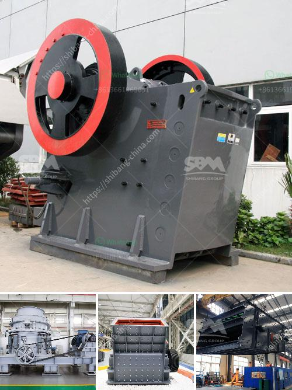

<h3>business plan for aggregates production plant pdf</h3>
A business plan for aggregates production plant PDF is a detailed blueprint of a business that specifies all the key components of the plant. The purpose of the plan is to foresee your startup's success and prepare for any potential obstacles along the way. It includes executive summaries, market analysis, financial projections, organizational structure, and so on.

The first section of the business plan focuses on the overall summary of the aggregates production plant. This includes the mission statement, vision, and objectives of the plant. It outlines what the plant aims to achieve and how it plans to accomplish those goals.

Next, the market analysis section provides an in-depth examination of the target market. It identifies potential customers, competitors, and market trends. Additionally, it highlights the demand for aggregates in the local and regional area, allowing the plant to determine if there is sufficient market potential.

Financial projections form a crucial part of the business plan. This section includes the plant's projected revenue, expenses, and cash flow over a specific period, typically five years. It enables the plant to assess its profitability and ascertain how long it may take to recover the initial investment. Furthermore, the financial projections help attract potential investors and secure financing for the plant.

The organizational structure section outlines the roles and responsibilities of each employee within the plant. It also includes details about the management team's experience and qualifications. This section demonstrates that the plant has a capable and skilled workforce, ensuring smooth operations.

Lastly, the business plan should include a comprehensive marketing and sales strategy. This details how the plant will promote its products and attract customers. It may include tactics such as advertising, creating strategic partnerships, and participating in industry trade shows.

In conclusion, a business plan for an aggregates production plant PDF is essential to guide the plant towards success. It provides a strategic outline of the plant's goals and objectives, market analysis, financial projections, organizational structure, and marketing strategy. By following the plan meticulously, the plant can maximize its chances of achieving profitability and long-term success.
<h3>Contact us</h3><ul><li><strong>Whatsapp:&nbsp;<a href="https://wa.me/8613661969651">+8613661969651</a></strong></li><li><a href="https://swt.shibang-china.com/?git&amp;zhl&amp;business plan for aggregates production plant pdf"><strong>Online Service(chat now)</strong></a></li></ul><h3>Related</h3><ul><li><a href='the production process of cobblestone.md'>the production process of cobblestone</a></li><li><a href='limestone crusher plant price in india.md'>limestone crusher plant price in india</a></li><li><a href='stone crusher in usa.md'>stone crusher in usa</a></li><li><a href='primary double deck screen price.md'>primary double deck screen price</a></li><li><a href='gold crushing machine price in usa.md'>gold crushing machine price in usa</a></li></ul>