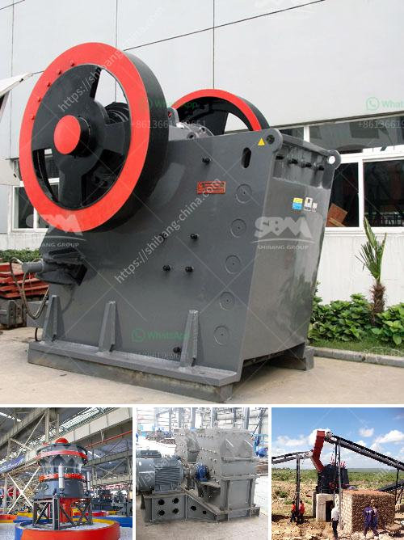

<h3>business plan for quarry</h3>
Starting a quarry is a very capital-intensive process. Although it requires more initial investment than many other business ventures, it can yield substantial profits in the long run. Quarry operations typically involve the extraction and processing of raw materials like limestone, sand, and gravel. The success of a quarry business depends on several factors, including market demand, location, and quality of the product being extracted. In this article, we will outline a comprehensive business plan for starting a quarry.

The first step in starting any business venture is conducting a thorough market analysis. Do thorough research to identify if there is a demand for the products you plan to extract and sell. Determine the current and future trends in the construction industry, as well as any government infrastructure plans that may increase demand for your products. Understanding the market will help you identify your target customers and build a marketing strategy accordingly.

Next, assess your financial resources. Starting a quarry requires significant upfront investment. You will need to secure funding to cover equipment costs, land acquisition, operational expenses, and working capital. Approach financial institutions and investors for potential partnerships or loans. Develop a detailed budget that includes all the necessary costs and provides a clear financial plan for the first few years of operation.

One crucial aspect of a quarry business plan is the location. The site should have a consistent and abundant supply of raw materials like limestone, sand, or granite. Ideally, it should be close to major construction sites, as transportation costs can significantly impact profitability. Conduct a geological study to ascertain the quality and quantity of available resources at your chosen site.

Obtain the necessary permits and licenses from the local authorities. Consult with environmental experts to ensure compliance with regulations and obtain any environmental impact assessments required. Failing to comply with these regulations can lead to costly legal issues and reputational damage.

Invest in high-quality equipment that will maximize productivity and efficiency. Essential equipment for a quarry includes crushers, screeners, loaders, excavators, and trucks. Invest in reliable and durable machinery that can withstand heavy use and the harsh conditions of a quarrying operation.

Develop a comprehensive marketing strategy to target your potential customers. Identify construction companies, builders, and infrastructure developers in your area and establish strong relationships with them. Attend trade shows and industry events to network with potential clients and showcase your product offerings. Utilize digital marketing channels like websites, social media, and online directories to reach a wider audience and increase visibility.

Build a team of qualified professionals with experience in the quarry industry. Hire skilled workers such as quarry managers, operators, and drivers who are knowledgeable about the extraction process and have a strong commitment to safety. Implement comprehensive health and safety protocols to protect your employees and mitigate any potential risks or accidents.

Regularly review and adapt your business plan to accommodate any changes in the market or industry. Continually monitor your financial performance and adjust your strategies accordingly. Stay up to date with technological advancements that can optimize quarry operations and enhance productivity.

In conclusion, starting a quarry requires meticulous planning and execution. Conducting market research, securing funding, choosing a suitable location, obtaining permits, investing in quality equipment, implementing effective marketing strategies, and building a skilled team are all crucial steps in creating a successful quarry business. By following this business plan, you will be well-positioned to capitalize on the demand for raw materials in the construction industry and achieve long-term profitability.
<h3>Contact us</h3><ul><li><strong>Whatsapp:&nbsp;<a href="https://wa.me/8613661969651">+8613661969651</a></strong></li><li><a href="https://swt.shibang-china.com/?git&amp;zhl&amp;business plan for quarry"><strong>Online Service(chat now)</strong></a></li></ul><h3>Related</h3><ul><li><a href='graphite processing machine.md'>graphite processing machine</a></li><li><a href='chrome mining business plan crusher.md'>chrome mining business plan crusher</a></li><li><a href='crusher plant for sale in south africa.md'>crusher plant for sale in south africa</a></li><li><a href='coal grinding mill in india.md'>coal grinding mill in india</a></li><li><a href='jaw crushers price.md'>jaw crushers price</a></li></ul>