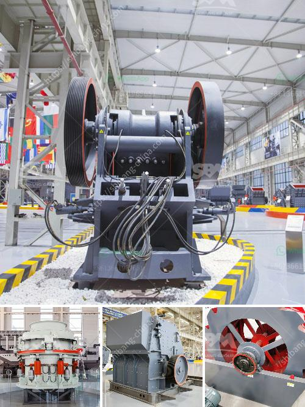

<h3>business plan on how to start a small scale quarry plant</h3>
Starting a small scale quarry plant is no easy feat, but if you have the determination and the right resources, it can be a profitable venture. Unlike other business ventures, a quarry plant does not require a huge investment as it involves only a few key pieces of machinery and tools. However, there are certain factors that need to be considered when creating a business plan for a small scale quarry plant.

One of the first things to consider is the location of the quarry. It should be strategically located near a construction site or a potential customer base to ensure a steady demand for the quarry products. Additionally, the location should have ample space for the machinery and equipment required in the quarry operations.

Next, you need to decide on the specific products you will be producing at the quarry plant. This could include crushed stones, aggregates, sand, or gravel. Conducting market research to understand the demand for these products in your area is crucial. This will help you determine the potential profitability of your venture.

Once you have identified the products, you will need to procure the necessary machinery and equipment. This may include excavators, loaders, trucks, crushers, screens, and conveyor belts. It is important to invest in reliable and efficient equipment that can withstand the harsh conditions of a quarry environment.

Additionally, you will need to hire skilled workers who have experience in quarry operations. This will ensure smooth and efficient production processes. It is also important to comply with safety regulations and provide proper training for your employees.

Marketing and sales strategies are also essential to consider in your business plan. You need to identify potential customers and develop a network of clients. This can be done through advertising, participating in industry trade shows, and building relationships with construction companies and contractors.

Finally, financial planning is crucial to the success of your small scale quarry plant. You need to determine the initial investment required, projected income, and ongoing expenses. It is advisable to seek professional guidance from an accountant or financial consultant to ensure accuracy and profitability.

In conclusion, starting a small scale quarry plant requires careful planning and consideration of various factors. By conducting thorough market research, procuring the necessary machinery, hiring skilled workers, implementing effective marketing strategies, and ensuring sound financial planning, you can set yourself up for a successful venture in the quarry industry.
<h3>Contact us</h3><ul><li><strong>Whatsapp:&nbsp;<a href="https://wa.me/8613661969651">+8613661969651</a></strong></li><li><a href="https://swt.shibang-china.com/?git&amp;zhl&amp;business plan on how to start a small scale quarry plant"><strong>Online Service(chat now)</strong></a></li></ul><h3>Related</h3><ul><li><a href='crushing and screening of aggregates in mexico.md'>crushing and screening of aggregates in mexico</a></li><li><a href='portable hammer mill for gold ore.md'>portable hammer mill for gold ore</a></li><li><a href='marble crusher machine in rajasthan.md'>marble crusher machine in rajasthan</a></li><li><a href='vibrating screen feeder.md'>vibrating screen feeder</a></li><li><a href='used sand mobile washing equipment.md'>used sand mobile washing equipment</a></li></ul>