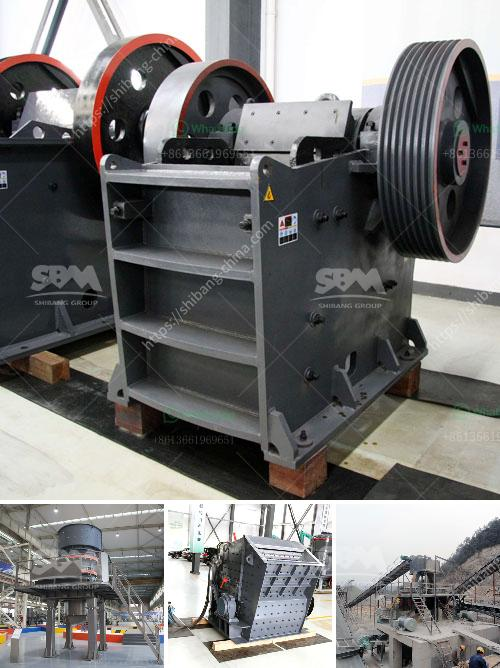

<h3>buy a cement blending plant in south africa</h3>
Are you considering purchasing a cement blending plant in South Africa? With its booming construction industry and a growing demand for high-quality cement, now is the perfect time to invest in this lucrative venture.

One of the key reasons to buy a cement blending plant in South Africa is the nation's thriving construction sector. The government has embarked on several infrastructure projects, including roads, bridges, and housing developments, which are expected to generate a substantial demand for cement in the coming years. By owning a cement blending plant, you can tap into this ever-growing market and contribute to the country's infrastructure development.

Additionally, South Africa's cement industry is known for its high standards and quality products. Investing in a blending plant here ensures that you will be able to produce cement that meets international standards and satisfies customer expectations. Furthermore, by owning a plant, you have better control over the production process, guaranteeing consistency and quality control throughout.

Another advantage of purchasing a cement blending plant in South Africa is the abundance of raw materials. The country boasts rich limestone reserves, a primary ingredient for cement production. This means that you can source raw materials locally, reducing transportation costs and ensuring a continuous supply chain.

Furthermore, South Africa's strategic location makes it an ideal gateway for export opportunities to neighboring countries in the region. By setting up a blending plant, you can capitalize on the growing demand for cement across African countries, expanding your business beyond national borders and increasing profitability.

In conclusion, if you are looking for a lucrative investment opportunity, buying a cement blending plant in South Africa is a wise choice. With a booming construction industry, high-quality cement standards, abundant raw materials, and export potential, the time is ripe to take advantage of this market. Invest in a cement blending plant now and reap the benefits of a profitable and sustainable business venture.
<h3>Contact us</h3><ul><li><strong>Whatsapp:&nbsp;<a href="https://wa.me/8613661969651">+8613661969651</a></strong></li><li><a href="https://swt.shibang-china.com/?git&amp;zhl&amp;buy a cement blending plant in south africa"><strong>Online Service(chat now)</strong></a></li></ul><h3>Related</h3><ul><li><a href='mining crusher plant limestone process.md'>mining crusher plant limestone process</a></li><li><a href='aggregate crusher machine.md'>aggregate crusher machine</a></li><li><a href='cost of 500 tpd cement plant india.md'>cost of 500 tpd cement plant india</a></li><li><a href='brick crusher for sale.md'>brick crusher for sale</a></li><li><a href='process of a granite crusher machine.md'>process of a granite crusher machine</a></li></ul>