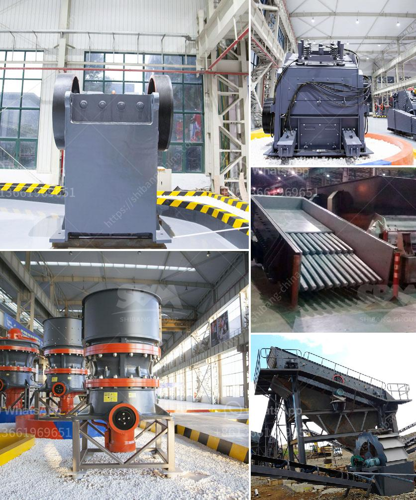

<h3>buy crusher of jaw</h3>
When it comes to crushing massive rocks and minerals into smaller pieces, nothing beats the efficiency and reliability of a jaw crusher. This powerful machine is commonly used in mining operations, construction sites, and recycling processes. If you are in the market for a jaw crusher, it is essential to understand the key aspects to consider before making a purchase decision.

Before embarking on your journey to buy a jaw crusher, it is crucial to determine your specific crushing requirements. Consider factors such as the types of materials you will work with (hard, soft, abrasive) and the desired output size. This preliminary step will help you identify the suitable jaw crusher model and specifications.

A jaw crusher operates on the principle of compressive force. The rocks are fed into the crushing chamber, where a movable jaw exerts pressure against a stationary jaw. This compressive force breaks the rocks into smaller pieces. Understanding this fundamental principle will help you appreciate the design and functionality of different jaw crusher models.

The capacity and power of a jaw crusher are crucial factors that determine its efficiency. Consider the amount of material you need to process per hour and the required power input to achieve the desired output size. Aim for a jaw crusher that can handle your expected production volumes without compromising on quality or speed.

To ensure a long service life and optimal performance, it is essential to factor in the maintenance requirements of a jaw crusher. Look for models that are easy to clean, inspect, and maintain. Consider features such as accessible wear parts, user-friendly control systems, and mobile capabilities for efficient onsite servicing.

Investing in a reliable jaw crusher that offers high-quality construction and superior durability is crucial. Look for reputable manufacturers known for producing robust machines that can withstand heavy-duty applications. Check customer reviews and ratings to gauge the performance and reliability of the jaw crusher models you are considering.

While cost is undeniably an important factor, don't compromise quality and performance for a lower price tag. Evaluate the overall value you are getting from the jaw crusher, considering its capabilities, durability, and potential return on investment. It is often worth spending more upfront if it guarantees a reliable and efficient crushing solution in the long run.

Choosing the right jaw crusher can significantly impact your operation's productivity and profitability. By considering factors such as your specific crushing needs, working principle, capacity requirements, maintenance, quality, durability, and cost, you can make an informed decision. Consult with reputable manufacturers or experts in the field to get detailed information on the available options and find the best crusher that suits your needs.
<h3>Contact us</h3><ul><li><strong>Whatsapp:&nbsp;<a href="https://wa.me/8613661969651">+8613661969651</a></strong></li><li><a href="https://swt.shibang-china.com/?git&amp;zhl&amp;buy crusher of jaw"><strong>Online Service(chat now)</strong></a></li></ul><h3>Related</h3><ul><li><a href='crusher manufacturers prices.md'>crusher manufacturers prices</a></li><li><a href='500tpd stone crushers.md'>500tpd stone crushers</a></li><li><a href='feldspar grinding machine.md'>feldspar grinding machine</a></li><li><a href='cost on vsi crusher.md'>cost on vsi crusher</a></li><li><a href='calcium carbonate grinding mill price.md'>calcium carbonate grinding mill price</a></li></ul>