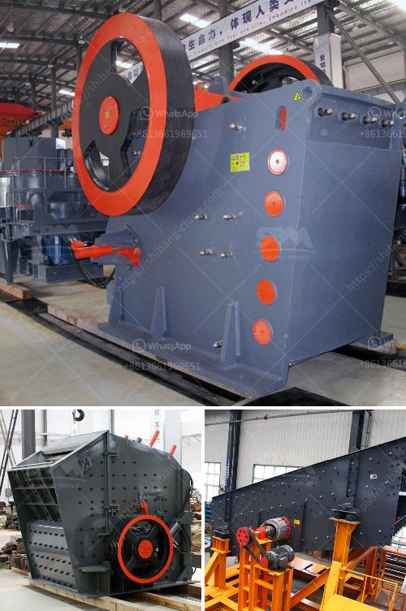

<h3>buy nigeria stone crusher</h3>
Nigeria is a vast country with considerable wealth in natural resources and understanding Nigeria’s geology is critical for efficient exploration and exploitation of these resources. Stone crushing is an important part in mining industry and require high quality stone crushing machines.

Nigeria has a large population and many people are involved in various kinds of stone crushing activities, such as mining, quarrying and construction. In conclusion, the stone crushing industry in Nigeria has been growing rapidly due to increasing demand from the construction industry and the present emphasis on developing the country’s infrastructure (such as roads, expressways, bridges, airports, etc.).

Therefore, Nigeria stone crusher machine industry is entering a new development era and has become a powerful country in the development of mine stone crusher machines. Nigeria is a vast country with considerable wealth in natural resources and understanding Nigeria’s geology is critical for efficient exploration and exploitation of these resources.

Stone crushing is an important part in mining industry and require high quality stone crushing machines. Jaw crushers are large stationary crushers and are available in a variety of models. They are generally fairly simple in design, making them easy to maintain or repair. Impact crushers are capable of producing mineral aggregate mixes in one single crushing stage in a closed-cycle operation, making them particularly cost-effective.

Different crusher machines are used for crushing materials, depending on the different properties of materials. They are raw coal, shale, slag, cement, limestone, construction waste, etc. They are also used for the crushing of processed material in the recycling industry, and for crusher of stone, rock, etc.

Besides, Nigeria has significant coal and iron ore reserves as well several gold, uranium, tantalum and REE showings throughout the country. With these resources, Nigeria can improve its mining industry development plans and bring more investment opportunities for contractors and investors.

In the mining industry, when a rock is encountered that is too hard to break apart with traditional drilling and blasting techniques, stone crusher machines are needed in order to be able to extract the minerals from the rock. This makes the crushing operation much easier and more efficient.

Many infrastructure projects are undertaken as part of Nigeria's national development plan, such as airports, roads, bridges, and more. These projects require a large amount of aggregate and sand, which can be produced by crushing stone, making stone crushing a major industry in Nigeria.

In order to achieve a win-win situation for both the quarry owner and the contractor, investment in the stone crushing industry is needed. With the current growth rate of global urbanization, the stone crushing equipment market is anticipated to witness a surge in demand for crushers applied in the construction of infrastructure and other activities.

Property owners and contractors are constantly looking for cost-effective solutions to their projects. Therefore, an increasing number of property owners, contractors, and construction companies are opting for portable stone crushers. These machines can be easily transported to different job sites and assembled quickly to help get the job done faster.

In conclusion, Nigeria’s stone crushing industry is booming and a great opportunity for investment. With the closing of many stone crushers, smaller quantities of aggregate are needed to complete the same amount of construction work. These smaller quantities will need less crushing and grinding to produce the same amount of stone aggregate, thus saving construction costs.

So looking forward to investing in Nigeria stone crushing industry is a good choice. This is largely due to the tremendous economic boom experienced by the country in recent years. The government has invested heavily in various infrastructure programs, such as roads, bridges, power plants, and so on. This has increased the demand for construction materials, which has created a growing market for stone crusher machines.
<h3>Contact us</h3><ul><li><strong>Whatsapp:&nbsp;<a href="https://wa.me/8613661969651">+8613661969651</a></strong></li><li><a href="https://swt.shibang-china.com/?git&amp;zhl&amp;buy nigeria stone crusher"><strong>Online Service(chat now)</strong></a></li></ul><h3>Related</h3><ul><li><a href='mtm 160 mill spare parts suppliers in india.md'>mtm 160 mill spare parts suppliers in india</a></li><li><a href='ethiopia gypsum manufacturers.md'>ethiopia gypsum manufacturers</a></li><li><a href='hammer mills for mining.md'>hammer mills for mining</a></li><li><a href='mobile chrome wash plant for sale.md'>mobile chrome wash plant for sale</a></li><li><a href='china quartz sand dryer manufacturer.md'>china quartz sand dryer manufacturer</a></li></ul>