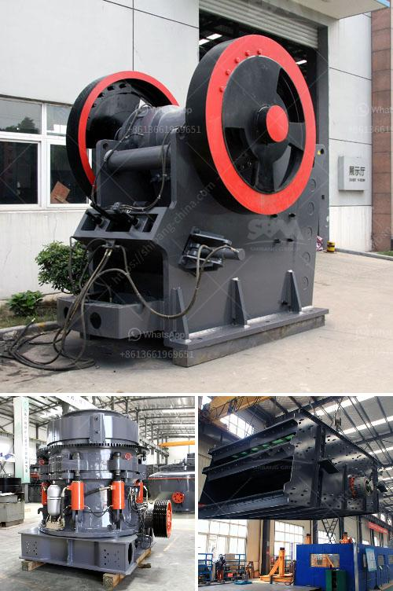

<h3>buy sand washing plant in sri lanka</h3>
Sri Lanka is an island country located in the Indian Ocean, known for its beautiful beaches and scenic landscapes. With increasing urbanization and development, the demand for sand has risen significantly in the country. This has led to an alarming rate of sand extraction, causing severe environmental damage. To tackle this issue and ensure sustainable sand production, many companies and individuals in Sri Lanka are turning to sand washing plants.

A sand washing plant is a facility that removes impurities from sand through a process of scrubbing, washing, and dewatering. This helps in producing high-quality sand suitable for use in various construction and industrial applications. The process involves separating the materials present in the sand, such as clay, silt, and organic particles, to improve its overall quality.

One of the main advantages of investing in a sand washing plant is the ability to produce clean and graded sand consistently. This ensures a steady supply of high-quality sand, which is essential for the construction industry in Sri Lanka. With construction projects booming across the country, the demand for sand is at an all-time high. By having a sand washing plant, construction companies can save both time and money by obtaining sand directly from their own facility.

Furthermore, a sand washing plant can also help in conserving water. The traditional methods of sand washing involve using large amounts of water, which can be detrimental to the environment and costly. With a sand washing plant, water is efficiently recycled and reused, reducing the overall water consumption. This not only helps in reducing environmental impact but also lowers operational costs for the users.

Investing in a sand washing plant in Sri Lanka can also lead to economic benefits. By producing high-quality sand, companies can gain a competitive advantage in the market. They can offer better quality construction materials, leading to increased customer satisfaction and potentially higher profits. Additionally, having a sand washing plant can create job opportunities, contributing to the local economy.

When considering buying a sand washing plant in Sri Lanka, there are a few factors to take into account. Firstly, it is important to choose a reputable manufacturer that offers reliable and durable equipment. Researching different manufacturers and reading customer reviews can help in making an informed decision. Secondly, the size and capacity of the plant should be determined based on the specific requirements of the user. Lastly, it is crucial to consider the after-sales service and technical support offered by the manufacturer to ensure smooth operation and maintenance of the plant.

In conclusion, investing in a sand washing plant in Sri Lanka is a strategic decision for companies and individuals involved in the construction industry. It provides a sustainable solution to the increasing demand for sand, while also contributing to environmental conservation. By producing high-quality sand, companies can gain a competitive advantage and potentially increase their profits. With the right research and decision-making, buying a sand washing plant can be a beneficial investment in the long run.
<h3>Contact us</h3><ul><li><strong>Whatsapp:&nbsp;<a href="https://wa.me/8613661969651">+8613661969651</a></strong></li><li><a href="https://swt.shibang-china.com/?git&amp;zhl&amp;buy sand washing plant in sri lanka"><strong>Online Service(chat now)</strong></a></li></ul><h3>Related</h3><ul><li><a href='quartz ball for ball mill.md'>quartz ball for ball mill</a></li><li><a href='granite impact crusher.md'>granite impact crusher</a></li><li><a href='silica sand production plant in germany.md'>silica sand production plant in germany</a></li><li><a href='quotations for stone crushers.md'>quotations for stone crushers</a></li><li><a href='calcium carbonate grinding mill price.md'>calcium carbonate grinding mill price</a></li></ul>