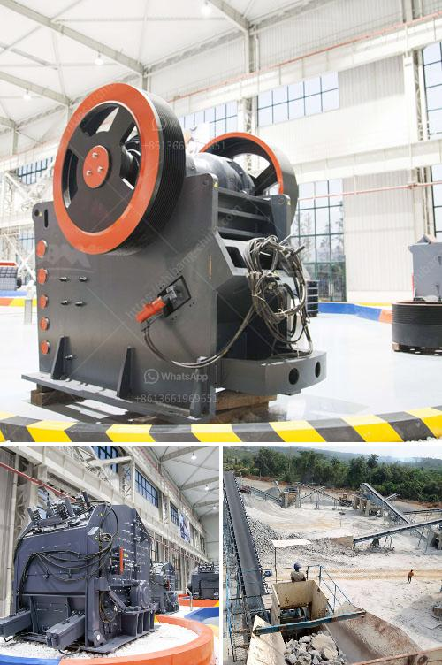

<h3>buy stone crusher in uae</h3>
Stone crushing industry is an important industrial sector in the country and it plays an important role in the development of infrastructure in UAE. The construction industry in UAE is growing rapidly due to the increasing demand for stone crushers. For construction sites, it is very important to have good quality aggregates such as 3/4, 1/2 and 3/8 inch, for concrete and asphalt production.

A stone crusher is a machine designed to reduce large rocks into smaller rocks, gravel, or rock dust. Stone crushers may be used to reduce the size, or change the form, of waste materials so they can be more easily disposed of or recycled, or to reduce the size of a solid mix of raw materials (as in rock ore), so that pieces of different composition can be differentiated.

There are several types of stone crusher machines available for sale in the market, including jaw crusher, cone crusher, impact crusher, hammer crusher and so on. Different types of crushers are used for different applications, and suitable configurations are selected according to the raw materials, capacity, and output size requirements.

Stone crushers facilitate proper differentiation of the raw materials for end use by breaking it down. The global stone crushing equipment market exhibits immense growth potential and is expected to grow at a fast pace during the forecast period. The rise in mining activities in the Middle East and Africa region has resulted in the increasing demand for stone crushers in the region.

According to World Mining Data, the total mining production across the globe was accounted for more than 16.5 billion metric tons in 2016, and the number is anticipated to increase significantly over the forecast period (2017-2025). This increase in mining activities leads to the need for robust machinery used in the mining process, such as crushers.

The UAE also has many infrastructure projects, such as the construction of roads and buildings, which leads to an increasing demand for stone crushers. The ability to process different types of materials and produce various sizes of output product makes a stone crusher capable of meeting the needs of even the most demanding construction projects.

There are a few things to consider in order to select the right stone crusher machine in UAE. One of the crucial factors is the size and capacity of the machine. Different machines have different capacity levels and feeding sizes. Some models are optimized for fine crushing, while others have higher capacity levels for processing large volumes of stone.

It is also important to consider the type of stone being crushed when selecting a stone crusher. Different machines are better suited to different stones. For example, impact crushers are ideal for breaking soft deformable stones, and cone crushers are suitable for breaking hard and abrasive stones.

To ensure that you purchase a high-quality stone crusher machine, it is important that you find a reliable supplier. This can be a daunting task, especially if you are buying the machine for the first time. An experienced supplier can guide you through the buying process and ensure that you get a machine that meets your specific requirements.

Stone crushers are an important part of the construction industry in UAE and they are also popular among various types of businesses. It is important to choose the right equipment that best suits your needs and budget. Thus, buying a stone crusher machine in UAE can be a wise decision if you have limited resources and need a machine with high capacity.
<h3>Contact us</h3><ul><li><strong>Whatsapp:&nbsp;<a href="https://wa.me/8613661969651">+8613661969651</a></strong></li><li><a href="https://swt.shibang-china.com/?git&amp;zhl&amp;buy stone crusher in uae"><strong>Online Service(chat now)</strong></a></li></ul><h3>Related</h3><ul><li><a href='stone crushers sale south africa.md'>stone crushers sale south africa</a></li><li><a href='silica sand production plant in germany.md'>silica sand production plant in germany</a></li><li><a href='sand gold crusher equipment made in canada.md'>sand gold crusher equipment made in canada</a></li><li><a href='price of concrete crushing machine for sale.md'>price of concrete crushing machine for sale</a></li><li><a href='iron ore beneficiation plant cost.md'>iron ore beneficiation plant cost</a></li></ul>