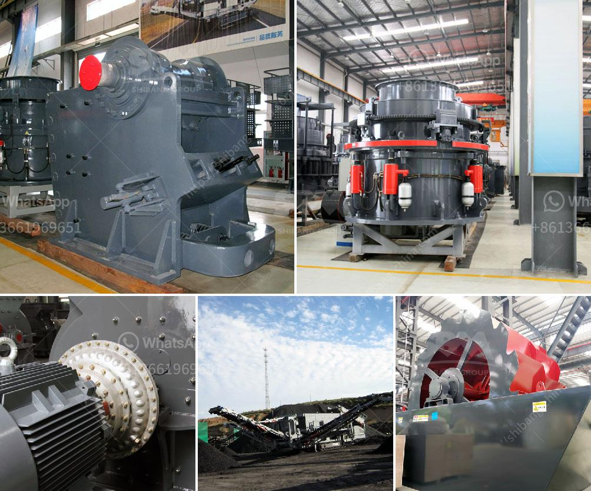

<h3>calcite powder lime stone</h3>
Calcite powder lime stone, also known as calcium carbonate, is a mineral compound that is commonly found in limestone. It has a wide range of uses and plays a crucial role in various industries. This versatile and sustainable mineral offers numerous benefits and has become an essential ingredient in many applications.

One of the primary uses of calcite powder lime stone is as a construction material. It is ideal for creating durable and long-lasting structures. The powder can be mixed with cement, sand, and water to make concrete. Its unique properties improve the workability, strength, and durability of the concrete mixture. Calcite powder lime stone also acts as a filler material in asphalt and a stabilizing agent in soil, making it an integral part of road construction.

In the manufacturing industry, calcite powder lime stone is widely used as a raw material. Its high calcium content makes it perfect for the production of calcium-based products such as glass, ceramics, and paint. The powder enhances the color, brightness, and opacity of these products, giving them a smooth and shiny finish. It is also used as a filler in paper production, improving its strength, whiteness, and printability.

Besides construction and manufacturing, calcite powder lime stone has medicinal and agricultural applications. It is a primary ingredient in antacids, providing relief from heartburn and indigestion. The powder also acts as a dietary calcium supplement, promoting bone health and preventing osteoporosis. In agriculture, calcite powder lime stone is added to the soil to increase its pH level and neutralize its acidity. It improves the soil's fertility, enhances nutrient absorption by plants, and prevents the growth of harmful bacteria and fungi.

One of the significant advantages of calcite powder lime stone is its sustainability. It is a naturally occurring mineral that is abundant in nature. The extraction and processing of calcite powder lime stone causes minimal environmental impact compared to other minerals. Additionally, once used, the mineral can be recycled and reused in various applications, reducing waste and promoting a circular economy.

Calcite powder lime stone also offers economic benefits. Its wide availability and low production costs make it an affordable material for many industries. The mineral is often locally sourced, reducing transportation costs and supporting local economies. Its versatile nature and numerous applications ensure a steady demand, creating job opportunities and contributing to economic growth.

However, it is essential to note that the extraction and processing of calcite powder lime stone should be done responsibly. Strict regulations and sustainable practices must be followed to minimize any potential environmental impacts. Companies should prioritize sustainability, invest in research and development to find new and innovative uses for the mineral, and explore cleaner and more energy-efficient production methods.

In conclusion, calcite powder lime stone is a versatile and sustainable mineral with multiple applications and benefits. Its properties make it an excellent choice for construction, manufacturing, medicine, and agriculture. With proper extraction and sustainable practices, calcite powder lime stone can continue to meet the growing demands of various industries while minimizing its environmental impact.
<h3>Contact us</h3><ul><li><strong>Whatsapp:&nbsp;<a href="https://wa.me/8613661969651">+8613661969651</a></strong></li><li><a href="https://swt.shibang-china.com/?git&amp;zhl&amp;calcite powder lime stone"><strong>Online Service(chat now)</strong></a></li></ul><h3>Related</h3><ul><li><a href='quarry equipment sale in usa.md'>quarry equipment sale in usa</a></li><li><a href='open cast mining equipment for sale south africa.md'>open cast mining equipment for sale south africa</a></li><li><a href='raymond mill spare part.md'>raymond mill spare part</a></li><li><a href='price of grinding machine in bangladesh.md'>price of grinding machine in bangladesh</a></li><li><a href='indonesia copper processing equipment for sale.md'>indonesia copper processing equipment for sale</a></li></ul>