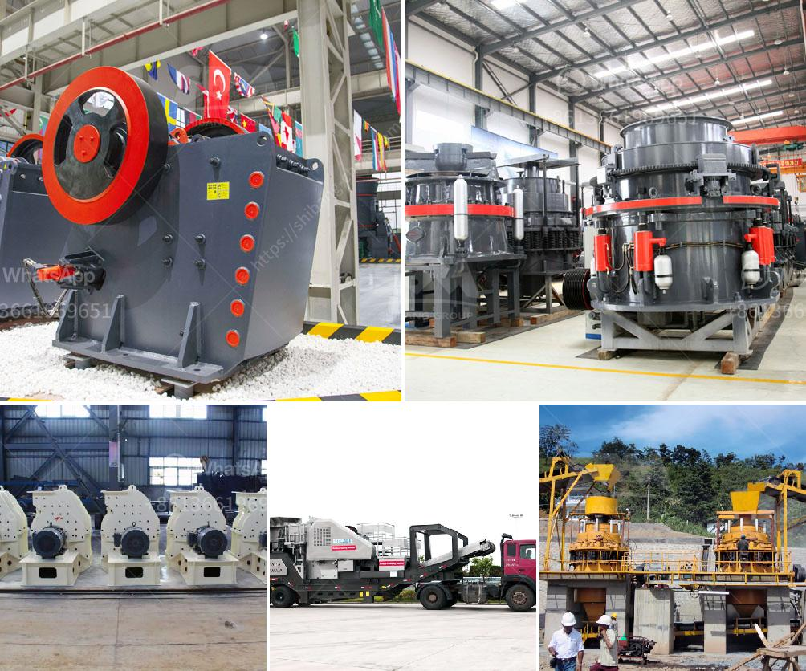

<h3>calcite powder making</h3>
Calcite powder is a commonly used mineral in many industries. It is a versatile substance that is used in construction, agriculture, and even medicine. But how is calcite powder made? In this article, we will explore the process of making calcite powder and its various applications.

Calcite, also known as calcium carbonate, is a mineral with the chemical formula CaCO3. It occurs naturally in a variety of forms, such as limestone, chalk, and marble. Raw calcite rocks are extracted from mines or quarries and then undergo a grinding process to produce the desired particle size for various applications.

The first step in making calcite powder is crushing the raw calcite rocks into small particle sizes. This is usually done with the help of a crusher or a grinding mill. The crushed calcite particles are then graded based on their size and purity.

Next, the graded calcite particles are subjected to a milling process. In this step, the particles are ground into a fine powder using specialized equipment such as ball mills, hammer mills, or roller mills. The milling process helps to further reduce the particle size and enhance the overall quality of the calcite powder. It also helps to remove impurities and undesirable substances from the final product.

After the milling process, the calcite powder is typically classified or air-dried to remove any excess moisture. The dried powder is then packaged and ready for use or further processing.

Calcite powder has a wide range of applications across various industries. In the construction industry, it is used as a filler material in cement, concrete, and asphalt. It improves the strength, durability, and workability of these materials. Calcite powder is also used in the manufacturing of glass, ceramics, and paints due to its high brightness and ability to act as a pigment.

In agriculture, calcite powder is used as a soil conditioner and pH regulator. It helps to neutralize acidic soils and improve the growth of plants. It provides essential nutrients such as calcium and magnesium to the soil, enhancing its fertility and productivity.

Furthermore, calcite powder is used in the manufacturing of pharmaceuticals and dietary supplements. It is a common ingredient in antacids and calcium supplements due to its ability to reduce acidity and provide essential calcium to the body.

In conclusion, the process of making calcite powder involves crushing, milling, grading, and drying raw calcite rocks. The resulting powder is versatile and finds applications in various industries, such as construction, agriculture, and medicine. Its unique properties, including high brightness, particle size distribution, and chemical composition, make it a valuable substance for numerous applications.
<h3>Contact us</h3><ul><li><strong>Whatsapp:&nbsp;<a href="https://wa.me/8613661969651">+8613661969651</a></strong></li><li><a href="https://swt.shibang-china.com/?git&amp;zhl&amp;calcite powder making"><strong>Online Service(chat now)</strong></a></li></ul><h3>Related</h3><ul><li><a href='cone crusher supply.md'>cone crusher supply</a></li><li><a href='copper crusher manufacturer in turkey.md'>copper crusher manufacturer in turkey</a></li><li><a href='ball mill feldspar 200 mesh output.md'>ball mill feldspar 200 mesh output</a></li><li><a href='roller for plate mill manufacturer.md'>roller for plate mill manufacturer</a></li><li><a href='south africa manganese ore jaw crusher south africa.md'>south africa manganese ore jaw crusher south africa</a></li></ul>