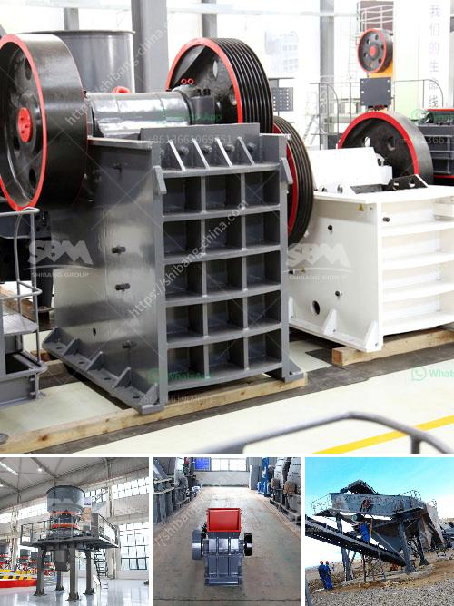

<h3>calcium carbide production machinery</h3>
Calcium carbide is a chemical compound used in various industrial applications, particularly in the production of acetylene gas. This compound is made through a process called calcium carbide manufacturing, which involves the use of specialized machinery. In this article, we will explore the machinery used in calcium carbide production and its importance in the overall manufacturing process.

The primary equipment used in calcium carbide production is an electric arc furnace. This high temperature furnace is designed to precisely melt the raw materials, namely limestone (CaCO3) and coke (coal). The intense heat generated in the furnace (approximately 2000 to 2300°F) causes a chemical reaction between the limestone and coke, leading to the formation of calcium carbide.

The electric arc furnace consists of electrodes that create an electric arc within the furnace chamber. This arc generates extreme heat, causing the limestone and coke to melt and react. The melted mixture is then tapped from the furnace into a holding vessel, where it solidifies into calcium carbide rocks or chunks.

To ensure efficient and continuous production, calcium carbide manufacturing plants usually have multiple electric arc furnaces operating simultaneously. These furnaces typically have a capacity ranging from a few tons to several hundred tons per day, depending on the scale of production.

Apart from the electric arc furnaces, several other types of machinery play crucial roles in the calcium carbide production process. Crushing machines or crushers are used to break down the large chunks of calcium carbide into smaller sizes. This facilitates easy transportation and further processing.

After crushing, the calcium carbide is often subjected to a series of additional processes such as drying, pulverizing, and sieving. These processes help to refine the final product, ensuring the desired particle size and purity.

Another essential piece of machinery in calcium carbide production is the calcium carbide drum furnace. This furnace is used to convert the solid calcium carbide into its gaseous form, acetylene. The calcium carbide is placed in a sealed drum furnace, and heat is applied to facilitate the release of acetylene gas.

The acetylene gas produced in the drum furnace is then captured and stored in high-pressure cylinders for various industrial applications. Acetylene is a versatile fuel gas widely used in welding, cutting, and heating applications. Its production from calcium carbide provides a cost-effective and convenient alternative to traditional sources of acetylene, such as hydrocarbon cracking.

In conclusion, calcium carbide production machinery is an integral part of the manufacturing process. The electric arc furnaces, crushers, and drum furnaces work together to produce calcium carbide and convert it into acetylene gas. These machines ensure efficient production and enable the widespread use of calcium carbide in various industrial applications. As technology advances, the machinery used in calcium carbide production continues to evolve, enabling safer and more efficient production processes.
<h3>Contact us</h3><ul><li><strong>Whatsapp:&nbsp;<a href="https://wa.me/8613661969651">+8613661969651</a></strong></li><li><a href="https://swt.shibang-china.com/?git&amp;zhl&amp;calcium carbide production machinery"><strong>Online Service(chat now)</strong></a></li></ul><h3>Related</h3><ul><li><a href='new trends in concrete technology slide presentation.md'>new trends in concrete technology slide presentation</a></li><li><a href='vertical ball mill with price.md'>vertical ball mill with price</a></li><li><a href='mobile vsi crusher.md'>mobile vsi crusher</a></li><li><a href='construction material recycling.md'>construction material recycling</a></li><li><a href='granite and marble business plan pdf.md'>granite and marble business plan pdf</a></li></ul>