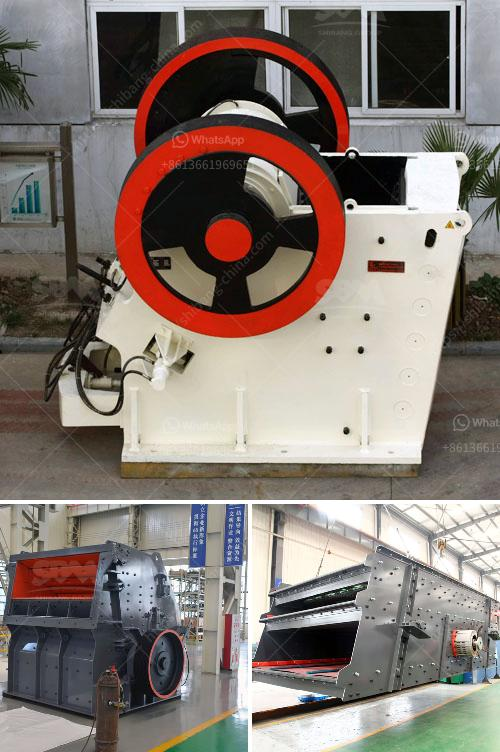

<h3>calcium carbonate grinding mill price</h3>
Calcium carbonate grinding mill is the indispensable processing machine to process calcium carbonate powder. It is vital in the powder grinding mill industry. Today, I will disclose to you what's the price of a calcium carbonate grinding mill with the output size of 100-300 mesh.

The demand for calcium carbonate is increasing rapidly, as it is an essential raw material for many industries such as paper, paint, plastic, and pharmaceuticals. With the rapid development of these industries, the demand for calcium carbonate is expected to rise, leading to an increased need for reliable grinding mills.

The price of a calcium carbonate grinding mill varies depending on various factors, such as the model, size, and capacity of the machine. The output size also plays a significant role in determining the price. A smaller capacity machine with a higher output size may have a lower price compared to a higher capacity machine with a smaller output size.

When choosing a calcium carbonate grinding mill, it is crucial to consider the quality of the machine. The quality of the grinding mill determines its durability, performance, and efficiency. Investing in a high-quality machine not only ensures a longer service life but also guarantees a higher productivity rate.

Moreover, it is essential to find a supplier that offers the best price without compromising on quality. Many suppliers in the market might offer attractive prices, but their machines may not meet the required standards. It is advisable to do thorough research and choose a trusted supplier renowned for their high-quality products and reliable after-sales services.

In conclusion, the price of a calcium carbonate grinding mill with an output size of 100-300 mesh varies based on various factors such as model, size, and capacity. However, investing in a high-quality machine is essential for increased productivity and profitability. Therefore, it is recommended to consider reputable suppliers that offer the best quality at a competitive price.
<h3>Contact us</h3><ul><li><strong>Whatsapp:&nbsp;<a href="https://wa.me/8613661969651">+8613661969651</a></strong></li><li><a href="https://swt.shibang-china.com/?git&amp;zhl&amp;calcium carbonate grinding mill price"><strong>Online Service(chat now)</strong></a></li></ul><h3>Related</h3><ul><li><a href='crushing plant pdf.md'>crushing plant pdf</a></li><li><a href='granite quarry crusher equipment.md'>granite quarry crusher equipment</a></li><li><a href='stone crushing plant supplier south africa.md'>stone crushing plant supplier south africa</a></li><li><a href='aggregates crushing plant assembly in china.md'>aggregates crushing plant assembly in china</a></li><li><a href='three roller mill pakistan.md'>three roller mill pakistan</a></li></ul>