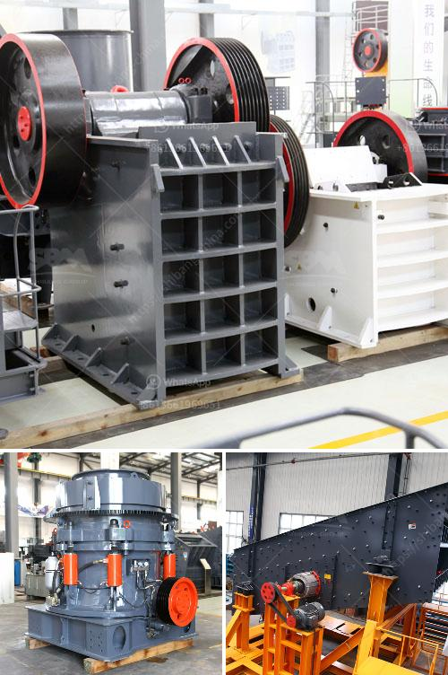

<h3>calcium carbonate mill equipment</h3>
Calcium carbonate is a chemical compound with the formula CaCO3. It is a common substance found in rocks, as the minerals calcite and aragonite, and is the main component of pearls and the shells of marine organisms, snails, and eggs. Calcium carbonate is widely used in various industries such as papermaking, plastics, paints, coatings, and pharmaceuticals due to its abundance, low cost, and versatility.

However, obtaining calcium carbonate in its purest form requires precise processing and grinding techniques. This is where calcium carbonate mill equipment plays a crucial role. These machines are designed to efficiently and effectively grind calcium carbonate into fine powder or micronized particles. In recent years, the calcium carbonate mill equipment has gained significant attention from producers looking to enhance their operations and product quality.

One of the key features of calcium carbonate mill equipment is its ability to produce high-quality ultra-fine powder. The mill equipment utilizes advanced grinding technology to ensure the particles are finely ground and have a uniform size distribution. This is particularly important for industries that require specific particle sizes for their products, such as the pharmaceutical and food industries.

Another advantage of using calcium carbonate mill equipment is its high efficiency and low energy consumption. These machines are designed to minimize energy usage while providing maximum output. By reducing energy consumption, producers can significantly lower their operational costs and improve their overall profitability.

Furthermore, calcium carbonate mill equipment offers excellent scalability and versatility. These machines can be customized to meet the specific requirements of different industries and production capacities. Whether it is a small-scale operation or a large industrial plant, calcium carbonate mill equipment can be tailored to suit the needs of any producer.

Moreover, the calcium carbonate mill equipment is designed for easy maintenance and operation. The machines are equipped with state-of-the-art automation systems that simplify the grinding process and minimize human intervention. This not only increases operational safety but also improves productivity by reducing downtime and optimizing production schedules.

In conclusion, calcium carbonate mill equipment is a revolutionary solution for industrial grinding. With its ability to produce high-quality ultra-fine powder, low energy consumption, scalability, and ease of operation, it offers considerable advantages to producers in various industries. By investing in advanced mill equipment, manufacturers can enhance their operations, improve product quality, and gain a competitive edge in the market. Whether it is to meet the demands of the papermaking, plastics, paints, coatings, or pharmaceutical industry, calcium carbonate mill equipment provides a reliable and efficient solution for grinding this versatile compound.
<h3>Contact us</h3><ul><li><strong>Whatsapp:&nbsp;<a href="https://wa.me/8613661969651">+8613661969651</a></strong></li><li><a href="https://swt.shibang-china.com/?git&amp;zhl&amp;calcium carbonate mill equipment"><strong>Online Service(chat now)</strong></a></li></ul><h3>Related</h3><ul><li><a href='crusher manufacturers in india.md'>crusher manufacturers in india</a></li><li><a href='stone crusher for sale in zimbabwe.md'>stone crusher for sale in zimbabwe</a></li><li><a href='quartz processing technique.md'>quartz processing technique</a></li><li><a href='hard rock gold mining equipment.md'>hard rock gold mining equipment</a></li><li><a href='petroleum coke mill.md'>petroleum coke mill</a></li></ul>