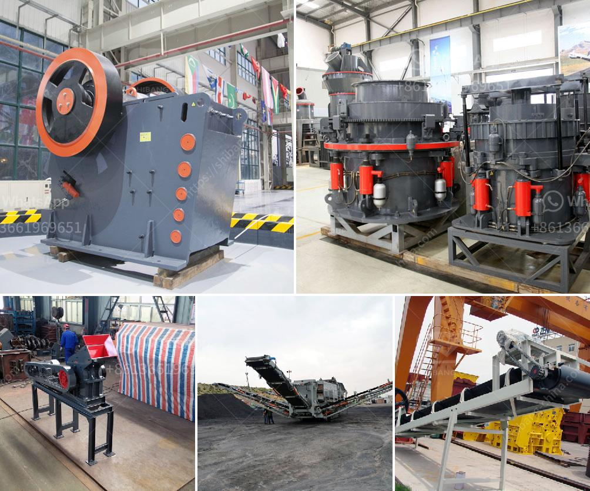

<h3>calcium carbonate plant sell in india</h3>
India's calcium carbonate market has witnessed significant growth over the years. The demand for calcium carbonate, a versatile mineral used in a range of industries, has consistently increased, leading to a rise in the establishment of calcium carbonate plants across the country. These plants play a crucial role in meeting the rising demand and supplying high-quality calcium carbonate to various industries.

Calcium carbonate, also known as limestone powder or chalk, is widely used in the construction, paper, rubber, and pharmaceutical industries, among others. It is used as a filler, thickening agent, and coating material in the production of various products. The buoyant growth in these sectors has further propelled the demand for calcium carbonate.

India is well-endowed with vast reserves of calcium carbonate deposits, making it an ideal location for establishing calcium carbonate plants. The presence of these plants not only ensures a steady supply of calcium carbonate but also contributes to the country's economic growth. Moreover, the establishment of these plants generates employment opportunities and boosts the local economy.

Several Indian companies specialize in manufacturing and selling calcium carbonate obtained from their plants. These companies focus on delivering high-quality products that meet the diverse requirements of different industries. The calcium carbonate produced undergoes rigorous testing to ensure purity, fineness, and adherence to industry standards.

The calcium carbonate plant sell in India offers a wide range of products tailored to cater to various needs. This includes coated calcium carbonate, precipitated calcium carbonate, and ground calcium carbonate, each with specific characteristics suited for different applications. Companies provide customized solutions and technical support to their customers, helping them optimize their processes and achieve desired outcomes.

The calcium carbonate industry in India is highly competitive, with companies consistently investing in research and development to introduce innovative products and improve manufacturing processes. These plants adhere to sustainable practices and are conscious of their environmental impact. They employ advanced technologies and efficient waste management techniques to minimize pollution and ensure the responsible use of resources.

In conclusion, the calcium carbonate plant sell in India is witnessing significant growth due to the rising demand for calcium carbonate across industries. These plants, located strategically to utilize the country's abundant reserves, contribute to India's economic progress by providing essential raw materials and creating employment opportunities. With a focus on delivering high-quality products and dedicated customer support, these plants play a vital role in meeting the diverse requirements of the customers and industries they serve.
<h3>Contact us</h3><ul><li><strong>Whatsapp:&nbsp;<a href="https://wa.me/8613661969651">+8613661969651</a></strong></li><li><a href="https://swt.shibang-china.com/?git&amp;zhl&amp;calcium carbonate plant sell in india"><strong>Online Service(chat now)</strong></a></li></ul><h3>Related</h3><ul><li><a href='gypsum mining plant.md'>gypsum mining plant</a></li><li><a href='types of equipments used in cement industry.md'>types of equipments used in cement industry</a></li><li><a href='ball mills machine.md'>ball mills machine</a></li><li><a href='stone crusher plant indonesia.md'>stone crusher plant indonesia</a></li><li><a href='conveyor systems for sand and gravel.md'>conveyor systems for sand and gravel</a></li></ul>