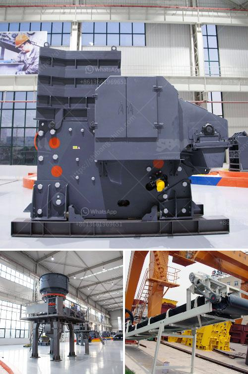

<h3>calcium carbonate plant</h3>
Calcium carbonate plants are used commercially for various applications. They produce a range of high-quality calcium carbonate products that are essential to numerous industries including construction, agriculture, pharmaceuticals, and environmental. In this article, we will take a closer look at calcium carbonate plants and their significance.

Calcium carbonate plants, also referred to as calcite or limestone plants, utilize numerous mechanical processes to produce various forms of calcium carbonate products. These plants also contribute to the carbon cycle by removing carbon dioxide from the atmosphere and converting it into a useful product.

The production of calcium carbonate starts with the extraction of limestone from quarries or mines. After the raw material is brought to the factory, it is crushed into small fragments and then washed to remove impurities. The purified limestone is then dried and sorted by size.

The next step involves the grinding of limestone fragments into a fine powder. This process is conducted in grinding mills where the particles are ground to an average size of around 10 microns. The grinding process ensures that the final product has a consistent particle size distribution and a high level of purity.

Once the limestone is finely ground, it is passed through a classifier that separates the particles into specific grades based on their size. The different grades of calcium carbonate can be used for different applications. For example, finer grades are used in the pharmaceutical industry, while coarser grades are used for construction purposes.

After the classification process, the calcium carbonate powder is transported to a storage silo where it awaits packaging or further processing. Some calcium carbonate plants might use a separate coating process to enhance the properties of the final product. Coated calcium carbonate particles have improved dispersibility, higher brightness, and increased resistance to moisture.

The final products of calcium carbonate plants are often sold as powder or granules in various packaging options. These products are used in a multitude of industries for their unique properties. In the construction industry, calcium carbonate is a key ingredient in the production of cement, concrete, and mortar. It acts as a filler and a reinforcing agent, improving the strength and durability of building materials.

In the agricultural sector, calcium carbonate is used as a soil conditioner to adjust the pH level and improve the nutrient content of the soil. It helps prevent soil erosion and provides essential nutrients to plants. Additionally, it is widely used in animal feed as a calcium supplement.

The pharmaceutical industry relies on calcium carbonate as an active ingredient in antacids and calcium supplements. It helps neutralize stomach acids and provides the necessary calcium for bone health. Moreover, calcium carbonate is used in the production of various medications such as antiallergic drugs and dietary supplements.

The environmental benefits of calcium carbonate plants cannot be overlooked. These plants play a crucial role in reducing greenhouse gas emissions and combating climate change. During the production process, carbon dioxide gas is captured and converted into calcium carbonate, effectively removing it from the atmosphere.

In conclusion, calcium carbonate plants are vital for the production of high-quality calcium carbonate products used in numerous industries. They employ various mechanical processes to produce the desired particle size and purity. These plants contribute to the carbon cycle by converting carbon dioxide into a valuable product and have positive implications for the environment.
<h3>Contact us</h3><ul><li><strong>Whatsapp:&nbsp;<a href="https://wa.me/8613661969651">+8613661969651</a></strong></li><li><a href="https://swt.shibang-china.com/?git&amp;zhl&amp;calcium carbonate plant"><strong>Online Service(chat now)</strong></a></li></ul><h3>Related</h3><ul><li><a href='limestone beneficiation.md'>limestone beneficiation</a></li><li><a href='aggregate washing machine cost.md'>aggregate washing machine cost</a></li><li><a href='second hand ball mill and gauteng.md'>second hand ball mill and gauteng</a></li><li><a href='iron ore beneficiation plant.md'>iron ore beneficiation plant</a></li><li><a href='hammer mill 25 ton hour.md'>hammer mill 25 ton hour</a></li></ul>