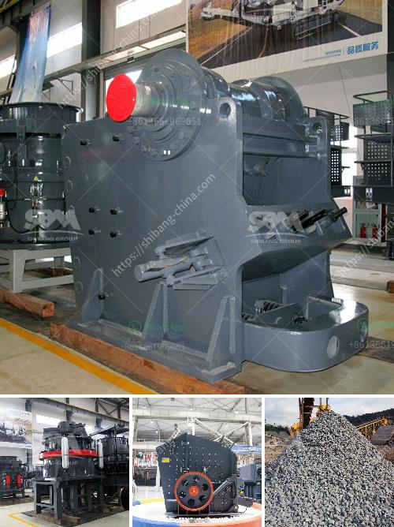

<h3>calcium carbonate powder coating machine in pune india</h3>
In recent years, there has been a significant increase in the demand for calcium carbonate powder in various industries. This versatile mineral is used in manufacturing processes across sectors such as paints, coatings, plastics, rubber, and many others. To meet this increasing demand, manufacturers are now investing in advanced technology and machinery, such as calcium carbonate powder coating machines. Pune, located in Maharashtra, India, is emerging as a prominent hub for the production and distribution of these machines.

Calcium carbonate powder coating is a process that involves the agitation of calcium carbonate particles in the presence of a coating agent to form a uniform layer on the particle's surface. This coating enhances the dispersion, flowability, and compatibility of calcium carbonate in various applications.

1. Improved product quality: The use of a dedicated powder coating machine ensures a uniform and consistent coating on the calcium carbonate particles, resulting in better product quality. This reduced variability in the coating thickness enhances the performance and characteristics of the end product.

2. Enhanced productivity: With the advent of automated powder coating machines, manufacturers in Pune can now achieve higher production rates. These machines are designed to coat large quantities of calcium carbonate powder efficiently, thereby increasing productivity and reducing manual labor requirements.

3. Cost savings: By investing in a calcium carbonate powder coating machine, manufacturers can achieve significant cost savings. These machines are designed to optimize the coating process, reducing material waste and minimizing energy consumption. Moreover, they eliminate the need for outsourcing the coating process, resulting in further cost reductions.

4. Environmental benefits: The use of powder coating machines in Pune ensures a cleaner and more eco-friendly production process. Unlike traditional liquid coating methods, powder coating does not involve the use of solvents or harmful volatile organic compounds (VOCs). As a result, powder coating significantly reduces environmental pollution and helps industries adhere to sustainability regulations.

1. Industrial ecosystem: Pune has a well-established industrial ecosystem, with a strong presence of manufacturing companies across multiple sectors. This makes it an attractive location for manufacturers of calcium carbonate powder coating machines, as it provides access to a large customer base and potential collaboration opportunities.

2. Technical expertise: Pune is known for its skilled workforce and technical expertise in the field of engineering and machinery manufacturing. The availability of qualified technicians and engineers makes it easier for manufacturers to develop and produce high-quality powder coating machines.

3. Strategic location: Pune's strategic location in Maharashtra gives it convenient access to major transportation networks, including roads, railways, and ports. This makes it easier for manufacturers to import raw materials and export finished machines not only within India but also to international markets.

The increasing demand for calcium carbonate powder in various industries has led to the rise of calcium carbonate powder coating machines in Pune, India. These machines offer several advantages such as improved product quality, enhanced productivity, cost savings, and environmental benefits. Pune's industrial ecosystem, technical expertise, and strategic location make it an ideal choice for manufacturers looking to establish their presence in the calcium carbonate powder coating machine market. With the continuous growth of industries that rely on calcium carbonate powder, the demand for these machines is expected to further rise in Pune and beyond.
<h3>Contact us</h3><ul><li><strong>Whatsapp:&nbsp;<a href="https://wa.me/8613661969651">+8613661969651</a></strong></li><li><a href="https://swt.shibang-china.com/?git&amp;zhl&amp;calcium carbonate powder coating machine in pune india"><strong>Online Service(chat now)</strong></a></li></ul><h3>Related</h3><ul><li><a href='mobile screening and crushing equipment.md'>mobile screening and crushing equipment</a></li><li><a href='stone crusher machine in south africa.md'>stone crusher machine in south africa</a></li><li><a href='corncob crusher machine.md'>corncob crusher machine</a></li><li><a href='rock crusher oman manufacturers in nigeria.md'>rock crusher oman manufacturers in nigeria</a></li><li><a href='small quartz appratus for crushing.md'>small quartz appratus for crushing</a></li></ul>