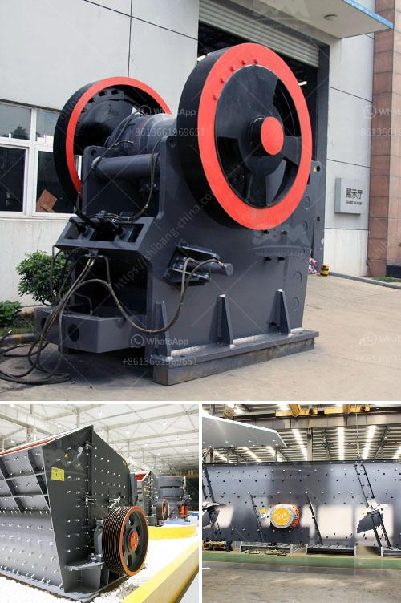

<h3>calcium carbonate pulverizer</h3>
Calcium carbonate pulverizer, also known as limestone pulverizer, is a machine commonly used in the processing of calcium carbonate materials. It plays an important role in the calcium carbonate production line and is essential for the crushing, grinding, and processing of the calcium carbonate powder.

Calcium carbonate is a compound found in numerous natural resources such as limestone, marble, and chalk. It is widely used in various industries, including construction, paper, plastics, paint, and food. The process of pulverizing calcium carbonate involves breaking the limestone into smaller pieces and further grinding them to a fine powder.

The calcium carbonate pulverizer is an important part of the calcium carbonate production line. It combines crushing, grinding, and classifying, all in one machine, making it convenient for users to obtain the desired calcium carbonate powder fineness. The pulverizer is designed with a high-speed rotating grinder, which generates a strong impact force on the calcium carbonate particles, breaking them into smaller pieces. The smaller particles are then further ground by the grinding chamber to achieve the desired fineness.

One of the key advantages of the calcium carbonate pulverizer is its high efficiency. It can rapidly and effectively process large quantities of calcium carbonate materials, saving time and energy for users. Additionally, the pulverizer is equipped with advanced technology and features, such as a built-in classifier system, which ensures that the produced calcium carbonate powder has a consistent particle size distribution.

Furthermore, the calcium carbonate pulverizer is built with a robust and durable structure, ensuring long-term reliability and minimal maintenance requirements. It is designed to withstand the harsh conditions of industrial environments and deliver consistent performance. The pulverizer also incorporates safety features, such as automatic overload protection and dust collection systems, ensuring a safe working environment.

In conclusion, calcium carbonate pulverizer is an essential machine in calcium carbonate production. It offers high efficiency, reliability, and safety, making it an ideal choice for industries that require calcium carbonate powder. Its ability to combine multiple processes into one machine streamlines the production process, increasing productivity and reducing costs. Whether it is used in construction, paper, plastics, paint, or food industries, the calcium carbonate pulverizer proves to be a valuable asset.
<h3>Contact us</h3><ul><li><strong>Whatsapp:&nbsp;<a href="https://wa.me/8613661969651">+8613661969651</a></strong></li><li><a href="https://swt.shibang-china.com/?git&amp;zhl&amp;calcium carbonate pulverizer"><strong>Online Service(chat now)</strong></a></li></ul><h3>Related</h3><ul><li><a href='harga stone crusher 400 x 600 harga stone crusher.md'>harga stone crusher 400 x 600 harga stone crusher</a></li><li><a href='stone crusher unit project report.md'>stone crusher unit project report</a></li><li><a href='portable crusher in malaysia.md'>portable crusher in malaysia</a></li><li><a href='crusher in china.md'>crusher in china</a></li><li><a href='bauxite crusher manufacturer.md'>bauxite crusher manufacturer</a></li></ul>