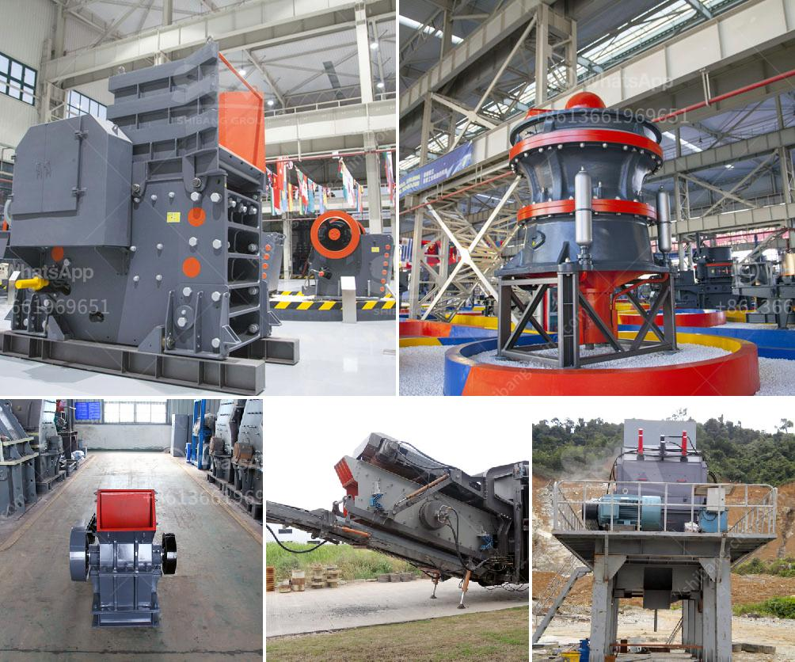

<h3>calcium grinding mill</h3>
Calcium carbonate is a widely used mineral in many industries. It is commonly used in the construction, paper, plastics, paints, and coatings industries. It is also an essential ingredient in agricultural supplements, animal feed, and pharmaceuticals. With such a diverse range of applications, the demand for calcium carbonate has been steadily increasing.

To cater to this growing demand, innovative solutions have been developed to efficiently grind and process calcium carbonate. One such solution is the calcium grinding mill, a machine specifically designed to grind calcium carbonate particles to a fine and uniform size.

The calcium grinding mill performs optimized crushing, grinding, and classification processes. It uses the latest grinding technology and has an advanced airflow dynamic system that ensures efficient particle size reduction. This mill can produce fine, ultrafine, and nano-sized calcium carbonate powder.

The calcium grinding mill is equipped with efficient and energy-saving wear-resistant parts, reducing the frequency of maintenance and ensuring longer service life. It also has an intelligent control system that allows operators to easily adjust process parameters and monitor the grinding process in real-time.

In addition to its technical features, the calcium grinding mill is also environmentally friendly. It is equipped with a dust collector system that effectively captures and filters out fine particles, minimizing environmental pollution. The mill is also equipped with noise reduction technology, ensuring a quieter working environment.

The calcium grinding mill is a game-changer in the calcium carbonate grinding industry. Its innovative design and superior performance have made it the preferred choice for many manufacturers and industrial users. Its ability to produce high-quality calcium carbonate powder with precise particle size control has significantly improved product quality and efficiency in various industries.

In conclusion, the calcium grinding mill is a revolutionary solution for calcium carbonate grinding. It offers numerous advantages, including efficient particle size reduction, easy operation and maintenance, environmentally friendly features, and improved product quality. With the growing demand for calcium carbonate, this mill has become an essential tool for many industries seeking to enhance their manufacturing processes.
<h3>Contact us</h3><ul><li><strong>Whatsapp:&nbsp;<a href="https://wa.me/8613661969651">+8613661969651</a></strong></li><li><a href="https://swt.shibang-china.com/?git&amp;zhl&amp;calcium grinding mill"><strong>Online Service(chat now)</strong></a></li></ul><h3>Related</h3><ul><li><a href='small ball mill for sale zimbabwe.md'>small ball mill for sale zimbabwe</a></li><li><a href='feldspar grinding mill suppliers india.md'>feldspar grinding mill suppliers india</a></li><li><a href='stone quarry crusher machine.md'>stone quarry crusher machine</a></li><li><a href='used coal washing plants for sale in india.md'>used coal washing plants for sale in india</a></li><li><a href='zimbabwe mobile crusher rentals.md'>zimbabwe mobile crusher rentals</a></li></ul>