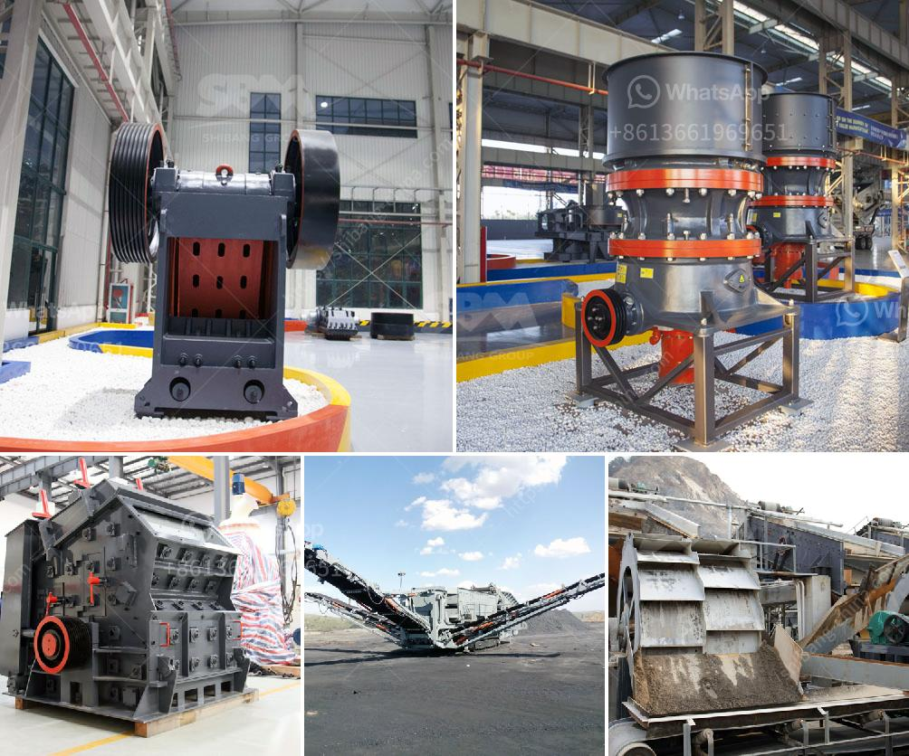

<h3>calcium oxide powder grinders</h3>
Calcium oxide powder grinders have gained significant popularity over the years due to their diverse range of applications. As a fine and odorless powder, calcium oxide, also known as quicklime, is widely utilized in various industries, such as construction, agriculture, and manufacturing. The use of grinders specifically designed for calcium oxide powder ensures efficient and consistent processing, enhancing the quality and effectiveness of the final product.

Calcium oxide powder grinders are essential tools for those working with this versatile substance. The grinders are engineered to crush the quicklime into a fine powder, enabling it to be easily mixed and incorporated into different applications. The ability to grind calcium oxide is crucial as it significantly increases its surface area, allowing for increased reactivity and effectiveness in various chemical reactions.

In construction, calcium oxide powder is commonly used as an important component in cement and mortar manufacturing. The grinders play a vital role by processing the quicklime into a finely ground powder, which is then combined with other materials to create strong and durable building materials. The use of grinders ensures that the calcium oxide particles are of the desired size, leading to enhanced cement and mortar properties, such as improved strength and setting time.

Agriculture is another sector that benefits from the use of calcium oxide powder grinders. Farmers often apply powdered quicklime to soil to adjust its pH level, promoting optimum soil health and crop growth. The grinders pulverize calcium oxide into a fine powder that can be easily spread across agricultural fields, ensuring even distribution and efficient soil amendment. By using grinders, farmers can achieve the desired particle size, enabling quicklime to rapidly react with the soil and neutralize acidity effectively.

Calcium oxide powder grinders are also extensively used in various manufacturing processes. They are crucial in producing chemicals, such as calcium carbide and calcium hydroxide, which are utilized in industries like steel production, water treatment, and paper manufacturing. The grinders enable efficient processing of calcium oxide, ensuring consistent and high-quality products.

The efficiency and reliability of calcium oxide powder grinders are due to several key features. These grinders typically have high-speed rotating blades or hammers that pulverize the quicklime into a fine powder. The grinding process is often controlled by adjustable grinding plates or screens, allowing users to achieve the desired particle size distribution. Additionally, advanced grinders may incorporate technologies like air classification systems or cyclones to separate the fine powder from any coarser particles, ensuring the final product is of top quality.

In conclusion, calcium oxide powder grinders are indispensable tools for various industries that employ calcium oxide in their processes. The grinders efficiently process quicklime into a fine powder, enhancing its reactivity and application versatility. Whether in construction, agriculture, or manufacturing, the use of grinders ensures consistent particle size distribution, leading to improved performance and quality of the final product. As calcium oxide continues to find new applications, the demand for high-quality powder grinders will continue to rise.
<h3>Contact us</h3><ul><li><strong>Whatsapp:&nbsp;<a href="https://wa.me/8613661969651">+8613661969651</a></strong></li><li><a href="https://swt.shibang-china.com/?git&amp;zhl&amp;calcium oxide powder grinders"><strong>Online Service(chat now)</strong></a></li></ul><h3>Related</h3><ul><li><a href='used stone crushers dealer.md'>used stone crushers dealer</a></li><li><a href='large jaw crusher for sale.md'>large jaw crusher for sale</a></li><li><a href='brick crusher for sale.md'>brick crusher for sale</a></li><li><a href='marchine stone crusher cost in kenya.md'>marchine stone crusher cost in kenya</a></li><li><a href='mill price hammer mill.md'>mill price hammer mill</a></li></ul>