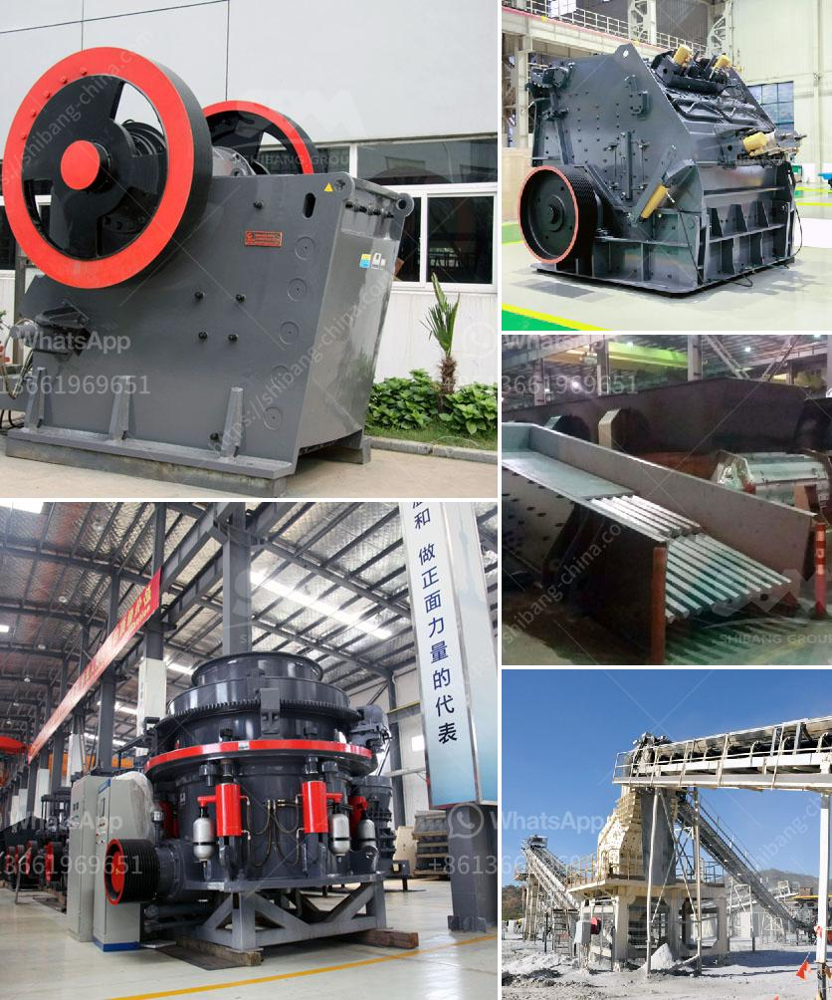

<h3>calcium powder machine</h3>
The calcium carbonate industry has witnessed a significant boost in recent years, with increased demand for various applications across multiple sectors. As a result, the need for efficient and advanced calcium powder machines has also grown rapidly. These machines have revolutionized the process of calcium carbonate production, offering enhanced productivity, quality, and cost-effectiveness.

A calcium powder machine is a specialized device specifically designed for grinding calcium carbonate into fine powder. It comprises a robust structure and cutting-edge technology that ensures the desired particle size and quality of the final product. This machine is equipped with high-speed rotating blades, which break down the calcium carbonate particles into smaller sizes.

One of the key advantages of a calcium powder machine is its ability to achieve a uniform particle size distribution, resulting in a superior end product. The machine's high precision ensures that every particle is of the same size, contributing to consistent quality and improved performance in various applications such as paper, plastics, paints, and coatings.

Moreover, these machines are highly versatile and can process calcium carbonate in various forms, including lump, granules, and fine powder. They can also handle different calcium carbonate grades, enabling manufacturers to produce a wide range of products tailored to their specific requirements.

In addition to the efficiency and quality, a calcium powder machine also offers significant cost benefits. The automated operation reduces labor costs and eliminates human errors, ensuring a higher production rate and minimized waste. The machine's energy-efficient design further lowers operational costs, making it an economical choice for calcium carbonate manufacturers.

Overall, a calcium powder machine has revolutionized the calcium carbonate industry by improving productivity, quality, and cost-effectiveness. Its advanced technology and precision grinding capabilities ensure a consistent particle size distribution and reliable performance in various applications. As the demand for calcium carbonate continues to grow, these machines will play a crucial role in meeting the industry's requirements efficiently and sustainably.
<h3>Contact us</h3><ul><li><strong>Whatsapp:&nbsp;<a href="https://wa.me/8613661969651">+8613661969651</a></strong></li><li><a href="https://swt.shibang-china.com/?git&amp;zhl&amp;calcium powder machine"><strong>Online Service(chat now)</strong></a></li></ul><h3>Related</h3><ul><li><a href='crusher manufacturers turkey.md'>crusher manufacturers turkey</a></li><li><a href='concrete crusher machine for sale.md'>concrete crusher machine for sale</a></li><li><a href='quartz powder machine manufacturer in india.md'>quartz powder machine manufacturer in india</a></li><li><a href='barite crusher equipment.md'>barite crusher equipment</a></li><li><a href='list of machinery used in the quarry.md'>list of machinery used in the quarry</a></li></ul>