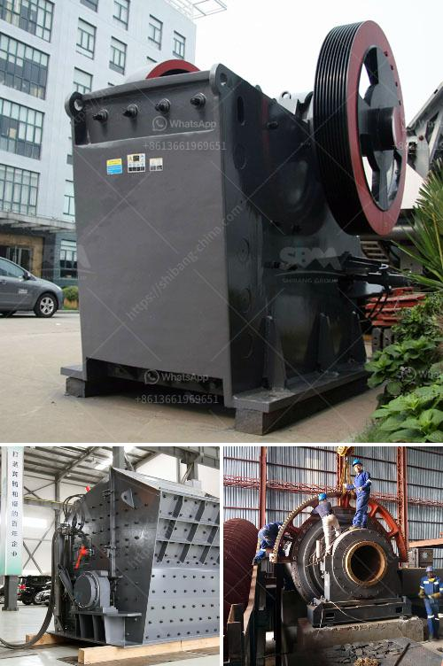

<h3>capacity of hammer mills used in kenya</h3>
Hammer mills have become a popular choice in Kenya as they enable farmers to process their grain crops efficiently and effectively. These machines are designed to crush and grind a variety of grains, such as maize, wheat, and barley, to produce a fine and uniform powder. The capacity of hammer mills used in Kenya varies depending on their models and sizes, ranging from 200 kg/h to 3,000 kg/h.

The capacity of a hammer mill is determined by its rotor diameter, screen size, and motor power. The larger the diameter of the rotor, the more grain it can hold at a time, resulting in higher production capacity. Similarly, a larger screen size allows for more grains to be processed simultaneously. Additionally, a higher motor power translates to faster and more efficient grinding.

The smaller hammer mills with a capacity of 200 kg/h are ideal for small-scale farmers, enabling them to process their grains for animal feed or for sale. These compact machines are easy to operate and require minimal maintenance. They are equipped with a 2.2 kW motor and a screen size of 1.5 mm, allowing for fine grinding.

On the other hand, larger hammer mills with a capacity of up to 3,000 kg/h are commonly used in larger farms or agro-industrial settings. These mills are powered by motors with capacities ranging from 7.5 kW to 22 kW, enabling them to handle large quantities of grains efficiently. They are designed with larger rotors and screens, ensuring high production rates and quality output.

In conclusion, the capacity of hammer mills used in Kenya varies depending on their models and sizes, ranging from 200 kg/h to 3,000 kg/h. These machines play a crucial role in the agricultural sector by providing farmers with an efficient and convenient method of processing their grain crops. Whether for small-scale farmers or larger agricultural operations, hammer mills are a valuable tool for grain processing.
<h3>Contact us</h3><ul><li><strong>Whatsapp:&nbsp;<a href="https://wa.me/8613661969651">+8613661969651</a></strong></li><li><a href="https://swt.shibang-china.com/?git&amp;zhl&amp;capacity of hammer mills used in kenya"><strong>Online Service(chat now)</strong></a></li></ul><h3>Related</h3><ul><li><a href='used rock fine crusher for sale.md'>used rock fine crusher for sale</a></li><li><a href='crusher machine for hardened powder.md'>crusher machine for hardened powder</a></li><li><a href='raymond mill spare part.md'>raymond mill spare part</a></li><li><a href='crusher plant for sale in south africa.md'>crusher plant for sale in south africa</a></li><li><a href='limestone production mining equipment for sale.md'>limestone production mining equipment for sale</a></li></ul>