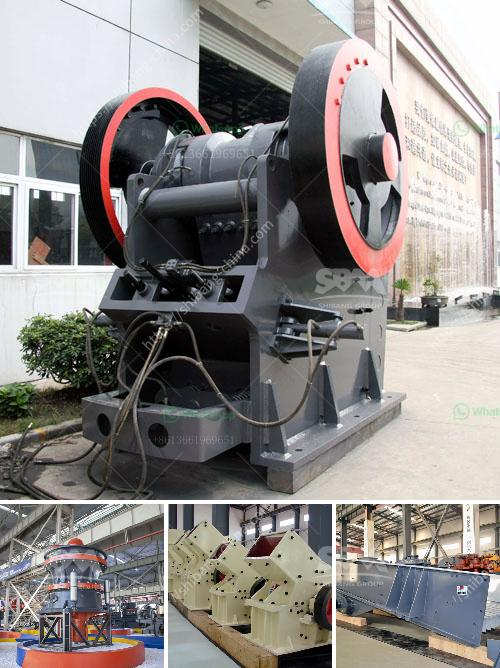

<h3>cara menghitung kapasitas pada belt conveyor</h3>
Cara menghitung kapasitas pada belt conveyor dapat dilakukan dengan beberapa langkah yang sederhana. Belt conveyor adalah suatu sistem mekanik yang paling sering digunakan untuk mengangkut material, seperti batu bara, pasir, bijih, dan banyak lagi, dari satu tempat ke tempat lain dengan efisien.

Dalam menghitung kapasitas pada belt conveyor, terdapat beberapa faktor yang perlu diperhatikan. Pertama, kita perlu mengetahui lebar belt conveyor yang digunakan. Lebar ini akan mempengaruhi kapasitasnya karena semakin lebar belt conveyor, semakin banyak material yang dapat diangkut dalam satu waktu. Selain itu, kita perlu mengetahui kecepatan belt conveyor yang digunakan. Kecepatan ini haruslah konstan dan haruslah sesuai dengan kebutuhan pengiriman material.

Kedua, kita perlu mengetahui berat jenis material yang akan diangkut oleh belt conveyor. Berat jenis adalah berat per satuan volume dari material tersebut. Misalnya, berat jenis batu bara adalah sekitar 0,8-1,2 ton/m3. Kemudian, kita juga perlu mengetahui sudut kemiringan belt conveyor. Sudut ini dapat mempengaruhi kapasitas dari belt conveyor karena semakin curam sudutnya, semakin lambat material dapat bergerak.

Setelah mengetahui faktor-faktor di atas, kita dapat menghitung kapasitas pada belt conveyor dengan menggunakan rumus berikut: Kapasitas = Lebar Belt Conveyor x Kecepatan Belt Conveyor x Berat Jenis Material x Sudut Kemiringan. Hasil dari perhitungan ini akan memberikan kita kapasitas maksimum dari belt conveyor dalam satuan ton per jam.

Dengan mengetahui kapasitas pada belt conveyor, kita dapat mengoptimalkan penggunaan belt conveyor dalam melakukan pengiriman material. Kita dapat menyesuaikan kecepatan dan lebar belt conveyor sesuai dengan kapasitas yang dibutuhkan. Hal ini akan membantu dalam meningkatkan efisiensi produksi dan mengurangi biaya operasional.

Jadi, menghitung kapasitas pada belt conveyor tidaklah sulit jika kita mengetahui faktor-faktor yang perlu diperhatikan. Dengan memperhatikan lebar belt conveyor, kecepatan belt conveyor, berat jenis material, dan sudut kemiringan, kita dapat mengoptimalkan penggunaan belt conveyor dan meningkatkan produktivitas dalam proses pengiriman material.
<h3>Contact us</h3><ul><li><strong>Whatsapp:&nbsp;<a href="https://wa.me/8613661969651">+8613661969651</a></strong></li><li><a href="https://swt.shibang-china.com/?git&amp;zhl&amp;cara menghitung kapasitas pada belt conveyor"><strong>Online Service(chat now)</strong></a></li></ul><h3>Related</h3><ul><li><a href='carbon grinding machine.md'>carbon grinding machine</a></li><li><a href='impact rock crusher.md'>impact rock crusher</a></li><li><a href='copper crusher manufacturer in turkey.md'>copper crusher manufacturer in turkey</a></li><li><a href='portable hammer mill for gold ore.md'>portable hammer mill for gold ore</a></li><li><a href='project proposal about grinding milling company.md'>project proposal about grinding milling company</a></li></ul>