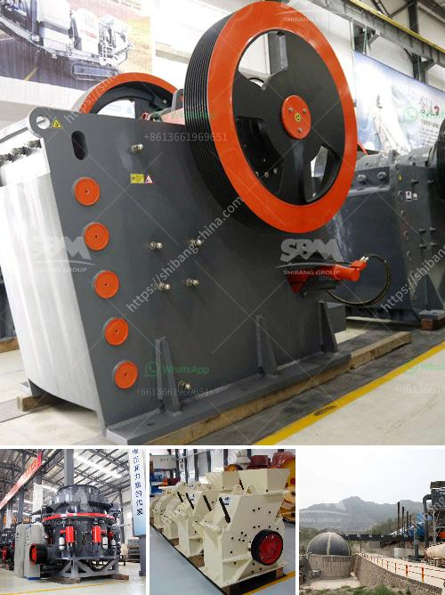

<h3>cara menghitung nar batubara in jakarta</h3>
When it comes to the energy industry, coal remains a significant resource worldwide. Coal is easily available, cost-effective, and can be utilized in various ways. In Indonesia, coal mining plays a crucial role in the economy, making it vital to understand key measurements like the Net As Received (NAR) value. This article aims to provide an overview of how to calculate NAR Batubara in Jakarta, highlighting its importance and applications.

First and foremost, NAR Batubara is a measurement used to assess the quality of coal, specifically its energy content. It refers to the energy content of coal after being analyzed and adjusted for moisture content. Moisture in coal can significantly impact its performance, making it necessary to consider when evaluating its value.

To calculate NAR Batubara, several steps need to be followed. The process starts by determining the Gross Calorific Value (GCV), which is the heating value of coal when it is completely burnt. This value is crucial in measuring the quality of coal as it directly correlates with its energy content.

Next, the moisture content of the sample is measured. It is essential to note that moisture levels in coal can vary significantly, impacting its energy production capabilities and transportation costs. The moisture content is expressed as a percentage.

Once these variables are determined, the next step is subtracting the moisture percentage from 100. This calculation yields the total moisture, which represents the percentage of remaining dry coal content after subtracting moisture.

Lastly, to obtain the NAR Batubara value, the Gross Calorific Value is divided by the total moisture content percentage. The resulting figure signifies the energy content per unit of weight or volume of coal.

Understanding how to calculate NAR Batubara is essential for various stakeholders in the coal industry in Jakarta. Coal producers can utilize this measurement to determine the energy content of their product, providing crucial information for pricing and marketing decisions. Since NAR Batubara reflects the quality of coal, it enables buyers to compare different coal types and choose the most suitable one for their needs, ensuring optimal performance and cost-effectiveness.

Moreover, NAR Batubara plays a vital role in the trading and transportation of coal. As moisture significantly affects coal's weight, understanding its impact is crucial for accurate pricing. By considering the NAR Batubara value, transporters can ensure accurate calculations when determining transportation costs, especially when dealing with large quantities.

Overall, calculating NAR Batubara in Jakarta is essential for both the coal industry and the economy. This measurement allows stakeholders to determine the energy content of coal accurately, aiding in pricing, trade, and transportation decisions. With its wide-ranging applications, understanding NAR Batubara becomes increasingly important for coal industry professionals in the Indonesian market.

In conclusion, the process of calculating NAR Batubara in Jakarta involves determining the Gross Calorific Value, measuring moisture content, subtracting moisture from 100 to obtain the total moisture, and finally, dividing the Gross Calorific Value by the total moisture to obtain the NAR value. By being familiar with this calculation process, various industry players can make informed decisions, ultimately contributing to the efficient and sustainable utilization of coal in Jakarta and beyond.
<h3>Contact us</h3><ul><li><strong>Whatsapp:&nbsp;<a href="https://wa.me/8613661969651">+8613661969651</a></strong></li><li><a href="https://swt.shibang-china.com/?git&amp;zhl&amp;cara menghitung nar batubara in jakarta"><strong>Online Service(chat now)</strong></a></li></ul><h3>Related</h3><ul><li><a href='concrete crusher hire nigeria.md'>concrete crusher hire nigeria</a></li><li><a href='raymond mill for sale.md'>raymond mill for sale</a></li><li><a href='difference between residual and transported soil.md'>difference between residual and transported soil</a></li><li><a href='cost of grinding machine.md'>cost of grinding machine</a></li><li><a href='indonesia copper processing equipment for sale.md'>indonesia copper processing equipment for sale</a></li></ul>