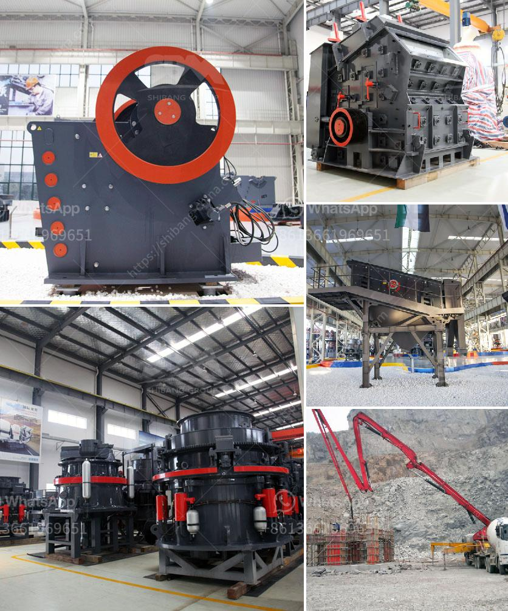

<h3>carbon grinding machine</h3>
In the world of manufacturing and production, there is a constant quest for efficiency and sustainability. As industries evolve, the need for advanced and innovative machinery becomes ever more pressing. One such groundbreaking invention is the carbon grinding machine, a device that has redefined grinding processes and set new benchmarks in the manufacturing industry.

The carbon grinding machine is designed to grind solid carbon materials into extremely fine particles, allowing for the efficient processing of carbon-based materials. It utilizes cutting-edge technology to effectively reduce carbon particle size while achieving high levels of productivity and precision. This machine has revolutionized multiple industries and is especially prominent in sectors such as carbon black manufacturing, pharmaceuticals, chemical processing, and many more.

One of the key advantages of the carbon grinding machine is its ability to produce uniform and homogeneous particles. This is achieved through the use of specialized grinding tools and techniques, which ensure a consistent particle size distribution. As a result, manufacturers can achieve better product quality, as well as increase their overall production efficiency.

Furthermore, the carbon grinding machine is highly versatile and can be utilized for various grinding applications. It can handle a wide range of carbon-based materials, including graphite, carbon black, coal, and coke, among others. This versatility allows manufacturers to explore new possibilities and expand their product offerings, resulting in enhanced competitiveness and market differentiation.

Another significant benefit of the carbon grinding machine is its energy efficiency. Traditional grinding processes often result in high energy consumption, leading to increased production costs and environmental impact. However, the carbon grinding machine utilizes advanced technologies that help minimize energy consumption while maintaining optimal grinding performance. This not only reduces operational expenses but also contributes to a more sustainable manufacturing process.

Moreover, the carbon grinding machine incorporates safety features that prioritize worker well-being. It is equipped with advanced ventilation systems that capture and remove airborne particles generated during the grinding process. This not only protects workers from harmful particle exposure but also ensures a clean and safe working environment.

In conclusion, the carbon grinding machine is a game-changer in the world of manufacturing. Its innovative design, versatile applications, and energy-efficient operation make it an invaluable asset for industries seeking to optimize their production processes. By enabling the production of uniform and homogeneous particles, manufacturers can achieve higher levels of product quality and productivity. Additionally, its versatility allows for the processing of various carbon-based materials, opening up new opportunities for product development and market expansion. Lastly, the machine's safety features prioritize worker well-being and environmental sustainability. The carbon grinding machine has undoubtedly revolutionized the manufacturing industry and represents a testament to human ingenuity and our commitment to a more sustainable future.
<h3>Contact us</h3><ul><li><strong>Whatsapp:&nbsp;<a href="https://wa.me/8613661969651">+8613661969651</a></strong></li><li><a href="https://swt.shibang-china.com/?git&amp;zhl&amp;carbon grinding machine"><strong>Online Service(chat now)</strong></a></li></ul><h3>Related</h3><ul><li><a href='small scale hard rock gold ore processing.md'>small scale hard rock gold ore processing</a></li><li><a href='grinding mill to produce particle size.md'>grinding mill to produce particle size</a></li><li><a href='general hypothesis of jaw crusher.md'>general hypothesis of jaw crusher</a></li><li><a href='company where they sell industrial mills.md'>company where they sell industrial mills</a></li><li><a href='malaysia crusher plant manufacturer and supplier.md'>malaysia crusher plant manufacturer and supplier</a></li></ul>