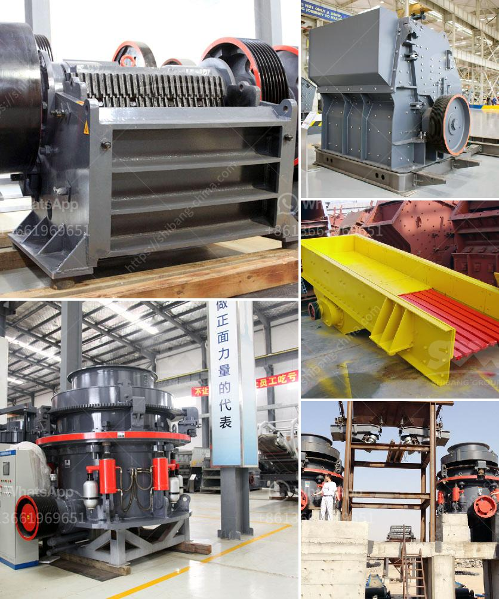

<h3>carbonate crusher price per ton</h3>
With the rapid development of the construction industry, the demand for carbonate crusher is increasing. Since carbonate can be used in a variety of sectors, such as industrial, agriculture, and construction, the price of carbonate crusher is different according to the types of carbonate. To illustrate, the carbonate crusher price per ton is different for different types.

Generally speaking, the standard type of cone crusher is applied to medium crushing. The medium type is applied to fine crushing. The short head type is applied to coarse fine crushing. As casting steel technique is adopted, the machine has excellent rigidity and large high strength. Working principle of carbonate crusher:

Carbonate crusher mainly adopts impact crushing or hammer crushing to achieve crushing, and the calcium carbonate crushing refers to the crushing of calcium carbonate, which is the main component of limestone. The main purpose of crushing calcium carbonate is to obtain calcium carbonate powder with suitable particle size.

The process of crushing calcium carbonate generally consists of two steps: crushing and grinding. The two processes are indispensable in the production of calcium carbonate powder. With the development of the construction industry, the demand for calcium carbonate powder is increasing, and the price of carbonate crusher also increases accordingly.

There are many factors affecting the price of carbonate crusher per ton. Some of the factors are as follows:

1. Quality of Crusher Machine: The quality of the crusher machine will affect the price of the machine directly. If the quality of the machine is good, the price will be higher. On the contrary, if the quality is poor, the price will be lower.

2. Type of Crusher Machine: There are different types of crusher machines for different materials. The price of carbonate crusher per ton varies with the type of crusher machine.

3. Application: The crushing and grinding process can be used in a variety of sectors, such as industrial, agriculture, and construction. The application of carbonate crusher varies, and the price per ton also varies.

4. Capacity: The capacity of the crusher machine determines the price per ton. For example, if the capacity is 200 tons per hour, the price per ton will be lower compared to a crusher with a capacity of 500 tons per hour.

In conclusion, the carbonate crusher price per ton varies from supplier to supplier and region to region. The price of carbonate crusher should be determined according to the actual production needs and specific requirements.

As the demand for carbonate crusher continues to increase, the price of carbonate crusher will also change. Therefore, it is necessary to choose a reliable supplier and compare prices before purchasing to ensure that the price of carbonate crusher per ton is reasonable and competitive.
<h3>Contact us</h3><ul><li><strong>Whatsapp:&nbsp;<a href="https://wa.me/8613661969651">+8613661969651</a></strong></li><li><a href="https://swt.shibang-china.com/?git&amp;zhl&amp;carbonate crusher price per ton"><strong>Online Service(chat now)</strong></a></li></ul><h3>Related</h3><ul><li><a href='production grinding mill europe.md'>production grinding mill europe</a></li><li><a href='limestone ball rod mill.md'>limestone ball rod mill</a></li><li><a href='mobile gold processing plant for sale.md'>mobile gold processing plant for sale</a></li><li><a href='diamond jaw crusher usa.md'>diamond jaw crusher usa</a></li><li><a href='ballast crusher supplier.md'>ballast crusher supplier</a></li></ul>