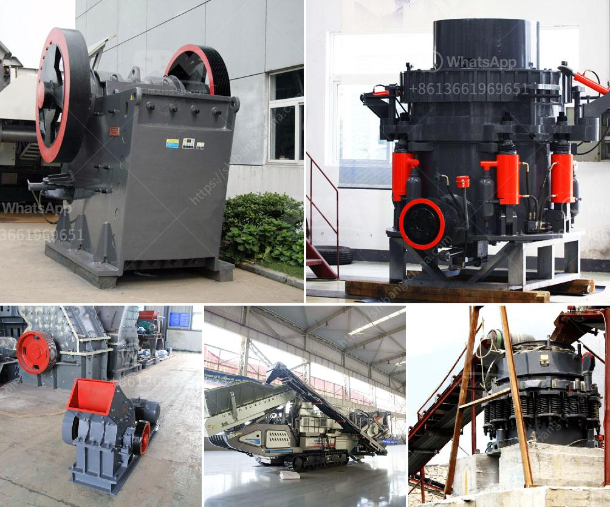

<h3>cde sand washing plant price</h3>
When it comes to sand washing plants, their cost varies depending on their type, size, and functionality. With that said, we can discuss the price range of CDE sand washing plants in order to give interested buyers an idea of how much they may cost. 

CDE is a global leader in materials wet processing technology and has been offering sand washing plants for more than two decades. Their plants are designed to maximize the yield of high-quality sand and reduce the waste and environmental impact associated with traditional sand washing methods.

CDE offers a wide range of sand washing plants, each designed to meet specific needs and budgets. The price of these plants typically ranges from $50,000 to $500,000, depending on the model, capacity, and configuration.

One of the main factors that determine the price of a CDE sand washing plant is its size. Smaller plants with lower capacity and fewer features tend to have a lower price, while larger plants with higher capacity and more advanced features come at a higher cost. This is because larger plants require more materials, labor, and engineering, which contributes to the overall price.

The type of sand washing plant also affects its price. CDE offers several types of plants, including compact sand plants, bucket wheel sand plants, and modular sand plants. Compact sand plants are smaller in size and offer basic washing and dewatering functions, making them more affordable. On the other hand, bucket wheel sand plants are larger and provide enhanced washing and dewatering capabilities, but they come at a higher price. Modular sand plants offer the highest level of customization and flexibility, but their price may vary depending on the specific features chosen.

In addition to the size and type of the plant, the specific features and components included can also impact the price. CDE offers various optional extras, such as cyclone systems, water recycling systems, and fines recovery units, which can enhance the functionality of the plant. These extras may increase the overall cost of the plant, but they can also improve the quality and efficiency of the washed sand, making them a worthwhile investment.

Lastly, the geographic location and local market conditions can have an impact on the price of CDE sand washing plants. Prices may differ between countries due to variations in taxes, import/export duties, labor costs, and other economic factors. Additionally, market demand and competition can influence the price, with higher demand resulting in higher prices.

In conclusion, the price of CDE sand washing plants can vary significantly depending on factors such as size, type, features, and market conditions. Potential buyers should carefully consider their specific requirements and budget in order to select the most suitable plant. It is also recommended to consult with CDE or their authorized dealers to get accurate pricing information and explore any available customization options.
<h3>Contact us</h3><ul><li><strong>Whatsapp:&nbsp;<a href="https://wa.me/8613661969651">+8613661969651</a></strong></li><li><a href="https://swt.shibang-china.com/?git&amp;zhl&amp;cde sand washing plant price"><strong>Online Service(chat now)</strong></a></li></ul><h3>Related</h3><ul><li><a href='organic fertilizer production line in india.md'>organic fertilizer production line in india</a></li><li><a href='cobalt mobile crushing plant.md'>cobalt mobile crushing plant</a></li><li><a href='gypsum import from bhutan.md'>gypsum import from bhutan</a></li><li><a href='complete crushing plant 100tph.md'>complete crushing plant 100tph</a></li><li><a href='silica sand crusher in ghana.md'>silica sand crusher in ghana</a></li></ul>