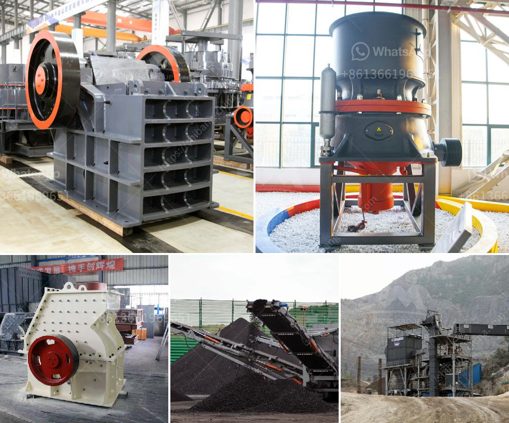

<h3>cement clinker conveyor belt</h3>
The cement industry heavily relies on efficient material handling for smooth operations, and one crucial element in this process is the cement clinker conveyor belt. This robust and reliable conveyor system plays a vital role in transporting cement clinker from one point to another in the production line.

The cement clinker conveyor belt is designed to handle the abrasive nature of clinker, ensuring smooth and efficient material flow. These belts are made from durable and high-quality materials, such as rubber or steel, with the necessary strength to handle heavy loads and withstand harsh environmental conditions.

One key advantage of utilizing a conveyor belt for cement clinker transportation is the elimination of manual handling, reducing the risk of injuries and improving overall workplace safety. The automated nature of the system allows for a continuous and controlled flow of clinker, optimizing the production process and minimizing downtime.

Efficiency is another significant benefit of using conveyor belts for cement clinker transport. The continuous movement of the belt ensures a consistent and timely delivery of clinker throughout the production line, preventing bottlenecks and optimizing productivity. With the ability to handle large volumes of clinker, conveyor belts enable manufacturers to meet the demands of a growing market.

Reliability is absolutely crucial in the cement industry, and conveyor belts for cement clinker have proven to be highly reliable and dependable over time. These belts are designed to handle heavy loads and endure the harsh conditions of a cement plant, ensuring uninterrupted material flow and minimizing maintenance requirements.

In conclusion, the cement clinker conveyor belt is an essential component in the cement production process, facilitating the smooth and efficient transport of clinker from one point to another. Its robust construction, automated operation, and high reliability make it an indispensable tool for the cement industry. As the industry continues to grow, cement manufacturers should invest in high-quality conveyor belts for cement clinker, optimizing their production capabilities and ensuring sustainable success.
<h3>Contact us</h3><ul><li><strong>Whatsapp:&nbsp;<a href="https://wa.me/8613661969651">+8613661969651</a></strong></li><li><a href="https://swt.shibang-china.com/?git&amp;zhl&amp;cement clinker conveyor belt"><strong>Online Service(chat now)</strong></a></li></ul><h3>Related</h3><ul><li><a href='feldspar crusher unit.md'>feldspar crusher unit</a></li><li><a href='mineral processing calculations pdf.md'>mineral processing calculations pdf</a></li><li><a href='iron ore beneficiation process price.md'>iron ore beneficiation process price</a></li><li><a href='sand washing machine in sri lanka.md'>sand washing machine in sri lanka</a></li><li><a href='gypsum board making machine price in india.md'>gypsum board making machine price in india</a></li></ul>