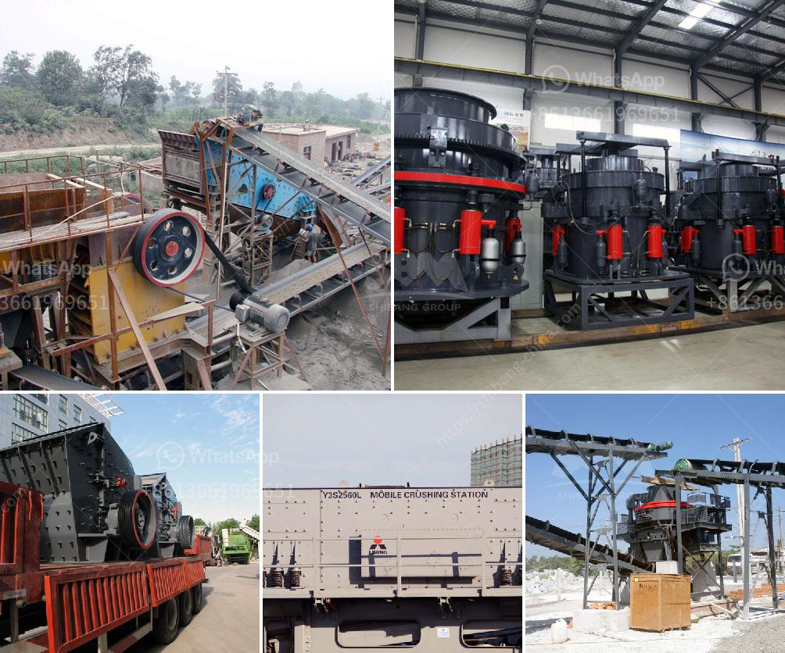

<h3>cement clinker manufacturing plant</h3>
Cement is a vital component in the construction industry, serving as a binding material that holds together bricks, stones, and other structural elements. At the heart of cement production lies the cement clinker manufacturing plant. This plant, often referred to as simply a clinker plant, is a key player in the production of cement.

The process of manufacturing cement clinker begins with limestone and clay. These raw materials are finely crushed and blended, then subjected to high temperatures in a kiln. The intense heat transforms the mixture into clinker, which is then ground into a fine powder to produce cement. This complex and resource-intensive process is what allows us to create the durable and versatile cement used in a variety of construction projects.

One of the crucial aspects of a cement clinker manufacturing plant is the kiln system. This system requires careful engineering and design to ensure optimal performance and energy efficiency. The kiln provides the necessary heat to activate chemical reactions within the raw materials and convert them into clinker. Proper control of temperature, fuel usage, and air circulation is essential to obtain high-quality clinker.

Additionally, environmental considerations play a significant role in modern cement clinker manufacturing plants. Efforts are made to minimize emissions, reduce energy consumption, and utilize alternative fuels and raw materials. Many plants incorporate technologies like preheaters and calciners to improve energy efficiency and decrease greenhouse gas emissions. By adopting these sustainable practices, cement clinker manufacturing plants contribute to a greener and more eco-friendly construction industry.

Another essential component of a clinker plant is the grinding mill. After the clinker is produced, it needs to be ground into a fine powder known as cement. Grinding mills use energy-intensive processes to pulverize the clinker into the desired particle size. These mills can be of various types, including ball mills, roller presses, and vertical roller mills. The choice of the grinding mill depends on several factors, such as the desired cement fineness, the capacity of production, and the availability of specific raw materials.

A cement clinker manufacturing plant acts as a core facility that supports the construction industry by providing a constant supply of cement. Cement is an indispensable material in various construction projects, ranging from residential buildings to infrastructure developments. Its versatility allows it to be used as a binding agent, structural support, or even as a decorative element. Without a reliable clinker plant, the construction industry would face delays and obstacles in executing projects.

In conclusion, the cement clinker manufacturing plant plays a vital role in the production of cement, which is an essential construction material. The complex process, involving the transformation of raw materials into clinker, requires careful engineering and energy-efficient practices. As sustainability becomes a central focus in the industry, clinker plants strive to minimize their environmental impact through the adoption of greener technologies. By providing a constant supply of cement, these plants contribute to the strength and durability of construction projects worldwide.
<h3>Contact us</h3><ul><li><strong>Whatsapp:&nbsp;<a href="https://wa.me/8613661969651">+8613661969651</a></strong></li><li><a href="https://swt.shibang-china.com/?git&amp;zhl&amp;cement clinker manufacturing plant"><strong>Online Service(chat now)</strong></a></li></ul><h3>Related</h3><ul><li><a href='mobile screening and crushing equipment.md'>mobile screening and crushing equipment</a></li><li><a href='rock processing plant.md'>rock processing plant</a></li><li><a href='sand crusher machinery china.md'>sand crusher machinery china</a></li><li><a href='stone crushing turkey.md'>stone crushing turkey</a></li><li><a href='ballast crusher supplier.md'>ballast crusher supplier</a></li></ul>