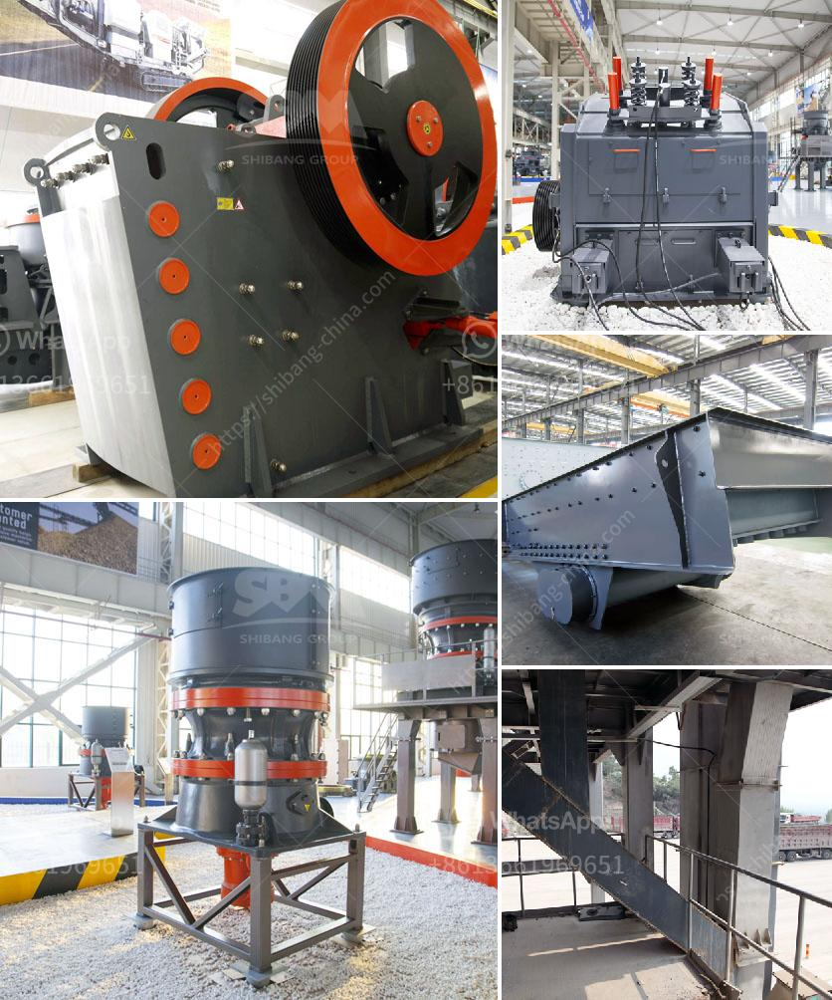

<h3>cement company in protea glen</h3>
The cement industry plays a crucial role in the construction sector, providing building materials that are essential for the development of infrastructures and structures worldwide. In South Africa, one cement company that has established a strong presence in the industry is located in Protea Glen. With its commitment to quality and sustainable practices, this cement company has become a trusted name in the construction market.

Protea Glen Cement Company has been operating for over three decades, continuously evolving and expanding to meet the growing demand for cement in the region. The company's state-of-the-art manufacturing facility is equipped with advanced machinery and technology, enabling it to produce high-quality cement products efficiently.

Quality is at the heart of Protea Glen Cement Company's operations. The company follows stringent quality control measures throughout the production process, ensuring that its products meet the required specifications and standards. This commitment to quality has earned the company ISO 9001 certification, a testament to its dedication to delivering reliable and durable cement to its customers.

In addition to producing top-tier cement, Protea Glen Cement Company is also dedicated to sustainable practices. The company understands the environmental impact of its operations and actively works towards reducing its carbon footprint. It has implemented several measures to conserve energy, reduce emissions, and minimize waste generation. By investing in technologies that optimize energy consumption and promote resource efficiency, the company strives to be environmentally responsible while meeting the construction industry's demands.

Protea Glen Cement Company understands that its success is not solely driven by high-quality products and sustainable practices. The company recognizes the value of building strong relationships with its customers and stakeholders. It prioritizes customer satisfaction and takes pride in its excellent customer service. The company's sales and support team works closely with clients to understand their unique requirements and offer tailored solutions that meet their specific needs.

Protea Glen Cement Company's commitment to the local community is also worth mentioning. The company actively engages in corporate social responsibility initiatives, focusing on education, health, and socio-economic development. It supports educational programs and scholarships, aiming to empower the youth with knowledge and skills for a better future. The company also works with local healthcare organizations to improve access to healthcare services and contributes to local community development projects.

Looking forward, Protea Glen Cement Company aims to continue its growth and expansion in the region. The company understands the importance of adapting to changing market dynamics and technological advancements. It regularly invests in research and development to improve its products and processes, ensuring it remains at the forefront of innovation in the cement industry.

In conclusion, Protea Glen Cement Company has successfully established itself as a reputable cement producer in the Protea Glen region. With a strong focus on quality, sustainability, customer satisfaction, and community development, the company has gained the trust and loyalty of its customers. As the construction industry continues to grow, Protea Glen Cement Company is well-positioned to meet the rising demand for construction materials while maintaining its commitment to excellence.
<h3>Contact us</h3><ul><li><strong>Whatsapp:&nbsp;<a href="https://wa.me/8613661969651">+8613661969651</a></strong></li><li><a href="https://swt.shibang-china.com/?git&amp;zhl&amp;cement company in protea glen"><strong>Online Service(chat now)</strong></a></li></ul><h3>Related</h3><ul><li><a href='ball mill manufacturer in philippines.md'>ball mill manufacturer in philippines</a></li><li><a href='fuel plant stone crusher.md'>fuel plant stone crusher</a></li><li><a href='processing of feldspar crushing.md'>processing of feldspar crushing</a></li><li><a href='dolomite crushing machine mill.md'>dolomite crushing machine mill</a></li><li><a href='zimbabwe mobile crusher rentals.md'>zimbabwe mobile crusher rentals</a></li></ul>