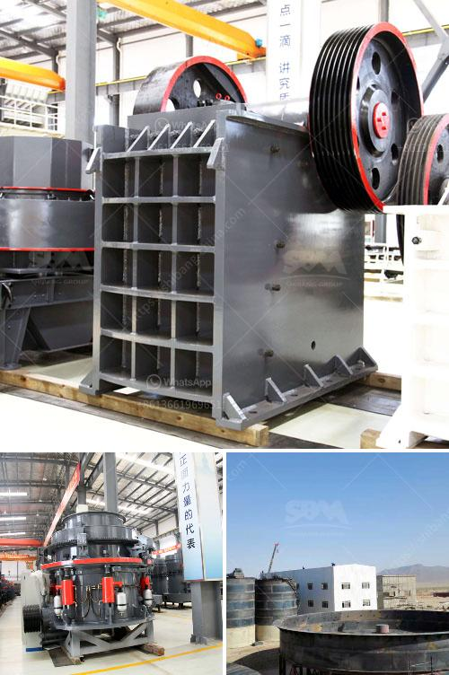

<h3>cement concrete crusher equipment</h3>
Cement concrete is one of the most widely used materials in construction. It is a composite material made of cement, sand, gravel, and water, which helps in providing strength and durability to the structure. To transform raw materials into usable products, crushing plays an essential role. In the construction industry, the equipment used for crushing cement concrete is known as a crusher. 

A cement concrete crusher is a piece of equipment that is designed to crush cement concrete materials into smaller pieces for use in further construction applications. The crusher can be specially designed to suit the size and type of the concrete that needs to be crushed. Different crushers have different crushing mechanisms, which can include jaw crushers, cone crushers, impact crushers, and others. 

One of the primary advantages of using a cement concrete crusher is that it helps in recycling and reusing waste materials. Construction sites often generate large amounts of waste concrete, which, if not properly managed, can lead to environmental pollution. By crushing and reusing this waste concrete, it is possible to reduce the need for new raw materials, which helps in conserving natural resources and minimizing waste. This is especially crucial in a time when sustainability and environmental impact are major concerns in construction.

Another advantage of using a cement concrete crusher is that it reduces the need for manual labor. Crushing concrete manually can be a labor-intensive and time-consuming process. By using a crusher, the process becomes faster, more efficient, and less dependent on manual labor. This results in increased productivity and cost savings for construction projects.

The quality of the crushed concrete is also a significant factor. A good cement concrete crusher equipment ensures that the crushed concrete has the desired size and shape for the intended use. It is important to choose a crusher that can produce high-quality crushed concrete without compromising on strength and durability. This ensures that the crushed concrete can withstand various types of loads and environmental conditions, making it suitable for a wide range of construction applications.

When selecting a cement concrete crusher equipment, it is essential to consider factors such as the type of concrete to be crushed, the required crushing capacity, and the desired output size. Additionally, factors such as energy efficiency, ease of maintenance, and reliability should also be taken into account. It is advisable to consult with experts or manufacturers to determine the most suitable crusher for specific construction needs.

In conclusion, a cement concrete crusher equipment is a valuable tool in construction projects. It aids in recycling and reusing waste materials, reduces the need for manual labor, and ensures the production of high-quality crushed concrete. By choosing the right crusher, construction projects can become more efficient, cost-effective, and environmentally friendly.
<h3>Contact us</h3><ul><li><strong>Whatsapp:&nbsp;<a href="https://wa.me/8613661969651">+8613661969651</a></strong></li><li><a href="https://swt.shibang-china.com/?git&amp;zhl&amp;cement concrete crusher equipment"><strong>Online Service(chat now)</strong></a></li></ul><h3>Related</h3><ul><li><a href='harga screw conveyor batching plant.md'>harga screw conveyor batching plant</a></li><li><a href='quick lime hammer crusher.md'>quick lime hammer crusher</a></li><li><a href='crushing and screening of aggregates in mexico.md'>crushing and screening of aggregates in mexico</a></li><li><a href='mining equipment price in ghana.md'>mining equipment price in ghana</a></li><li><a href='iron slag crushing ball mill in nagpur.md'>iron slag crushing ball mill in nagpur</a></li></ul>