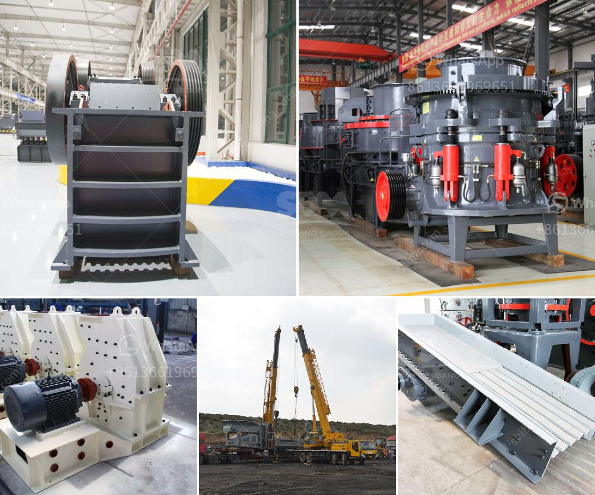

<h3>cement factories for sale in pakistan</h3>
Pakistan's cement industry has witnessed rapid growth in recent years, contributing significantly to the country's economic development. With the construction sector booming, cement factories are in high demand, making it an attractive investment opportunity. This article will explore the current market situation for cement factories for sale in Pakistan.

Pakistan's cement industry has become a major player in the global market, producing quality cement at competitive prices. The country's cement production capacity has increased significantly over the years, with several new cement plants coming into operation. This growth has been fueled by rising domestic demand, infrastructure projects, and government incentives for the construction sector.

Investing in cement factories in Pakistan offers multiple advantages. Firstly, the country benefits from a strategic geographical location, placing it at the crossroads of South Asia, the Middle East, and Central Asia. This location provides easy access to various markets, offering tremendous export potential. Additionally, Pakistan has a large population and a rapidly urbanizing society, ensuring a consistently high demand for cement.

Furthermore, the government of Pakistan has been actively promoting the construction sector, resulting in increased investments in infrastructure projects. This includes the construction of highways, bridges, dams, airports, and housing schemes. As a result, cement factories are enjoying a steady demand for their products, making it an ideal time to invest in this sector.

However, before venturing into the purchase of a cement factory in Pakistan, potential investors should consider several factors. Firstly, it is crucial to conduct market research to assess demand and competition in the area where the factory is located. Understanding the market dynamics and identifying potential growth opportunities are essential for successful investment.

Additionally, investors should thoroughly evaluate the existing infrastructure of the cement factory. Key factors to consider include the production capacity, machinery and equipment, quality control systems, and environmental compliance. Purchasing a well-maintained and state-of-the-art cement factory will ensure operational efficiency and productivity.

Another critical aspect to consider is the availability of raw materials. Cement production requires significant quantities of limestone, clay, gypsum, and other organic materials. Therefore, selecting a cement factory located in close proximity to raw material sources will help reduce transportation costs and ensure a sustainable supply chain.

Furthermore, investors should pay attention to the legal and regulatory environment associated with cement production in Pakistan. Familiarizing oneself with the country's taxation policies, labor laws, and environmental regulations is essential for smooth and compliant operations.

In conclusion, investing in cement factories for sale in Pakistan can be a lucrative opportunity. The country's growing construction sector, strategic location, and government support make it an attractive destination for investors. However, conducting thorough market research, evaluating infrastructure, and understanding the regulatory environment are crucial steps towards successful investment. With prudent decision-making, investors can tap into the abundant growth potential of Pakistan's cement industry.
<h3>Contact us</h3><ul><li><strong>Whatsapp:&nbsp;<a href="https://wa.me/8613661969651">+8613661969651</a></strong></li><li><a href="https://swt.shibang-china.com/?git&amp;zhl&amp;cement factories for sale in pakistan"><strong>Online Service(chat now)</strong></a></li></ul><h3>Related</h3><ul><li><a href='almond sand stone crusher price.md'>almond sand stone crusher price</a></li><li><a href='conveyor systems for sand and gravel.md'>conveyor systems for sand and gravel</a></li><li><a href='limestone powder production process.md'>limestone powder production process</a></li><li><a href='granite impact crusher.md'>granite impact crusher</a></li><li><a href='gold crushing plant.md'>gold crushing plant</a></li></ul>