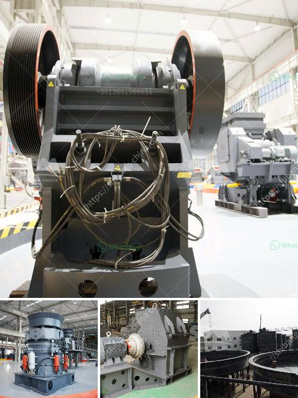

<h3>cement factory equipment list</h3>
A cement factory is a significant industrial facility that produces cement by mixing various raw materials such as limestone, clay, shells, and silica sand. It is also known as a cement plant or a cement manufacturing plant. The cement factory produced different types of cement, such as ordinary Portland cement, Portland Pozzolana cement, and slag cement.

To produce cement efficiently, a cement factory requires the right equipment. This article will provide an overview of the essential equipment that is commonly found in a cement factory.

1. Cement Kiln: This is the heart of the cement manufacturing process. The kiln is a large cylindrical structure where raw materials are heated to high temperatures (up to 1500°C) to convert them into clinker. The clinker is then ground to produce cement.

2. Raw Material Handling and Storage Equipment: These include equipment like hoppers, conveyors, and feeders. Hoppers are used to store and homogenize raw materials before they are transported to the kiln. Conveyors and feeders are used to transport the raw materials from hoppers to the kiln.

3. Crushers and Pre-grinders: These machines are used to crush or pre-grind the raw materials before they enter the kiln. Crushers reduce the size of the raw materials, while pre-grinders break down the clinker before it enters the grinding mill.

4. Raw Mill: This equipment grinds and dries raw materials into a fine powder, which is used to produce clinker.

5. Clinker Coolers: As the name suggests, these machines cool down the clinker after it exits the kiln. The cooling process is crucial to maintain the quality of the clinker and prevent it from overheating.

6. Cement Mill: This is the final step in the cement manufacturing process. After the clinker is ground to a fine powder in the raw mill, it is then mixed with gypsum and other additives to produce cement.

7. Packing and Dispatch Equipment: After the cement is produced, it needs to be packaged and dispatched to the market. This equipment includes packing machines, bag filters, and loaders.

8. Dust Collectors: Cement factories produce a significant amount of dust and pollutants during the manufacturing process. Dust collectors are used to capture and control these emissions, ensuring a clean and safe working environment.

9. Waste Heat Recovery Systems: These systems use the waste heat generated during the cement manufacturing process to generate electricity or provide thermal energy for other processes, helping to reduce the factory's energy consumption.

10. Laboratory Equipment: Quality control is essential in cement manufacturing. A cement factory requires a well-equipped laboratory to conduct various tests on raw materials, clinker, and cement to ensure that they meet the necessary standards and specifications.

In conclusion, a cement factory relies on several essential pieces of equipment to produce cement efficiently and maintain quality standards. From material handling to clinker cooling, grinding, and packaging, each equipment plays a crucial role in the overall cement manufacturing process. By investing in the right equipment and incorporating modern technology and practices, cement factories can continue to meet industry demands while ensuring sustainability and reducing environmental impact.
<h3>Contact us</h3><ul><li><strong>Whatsapp:&nbsp;<a href="https://wa.me/8613661969651">+8613661969651</a></strong></li><li><a href="https://swt.shibang-china.com/?git&amp;zhl&amp;cement factory equipment list"><strong>Online Service(chat now)</strong></a></li></ul><h3>Related</h3><ul><li><a href='wet grinding mill.md'>wet grinding mill</a></li><li><a href='gypsum plasterboard manufacturing process.md'>gypsum plasterboard manufacturing process</a></li><li><a href='tonnes per hour crusher.md'>tonnes per hour crusher</a></li><li><a href='buy sand washing plant in sri lanka.md'>buy sand washing plant in sri lanka</a></li><li><a href='how much investment needed to start a crusher in canada.md'>how much investment needed to start a crusher in canada</a></li></ul>